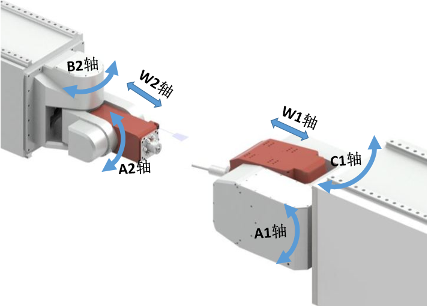
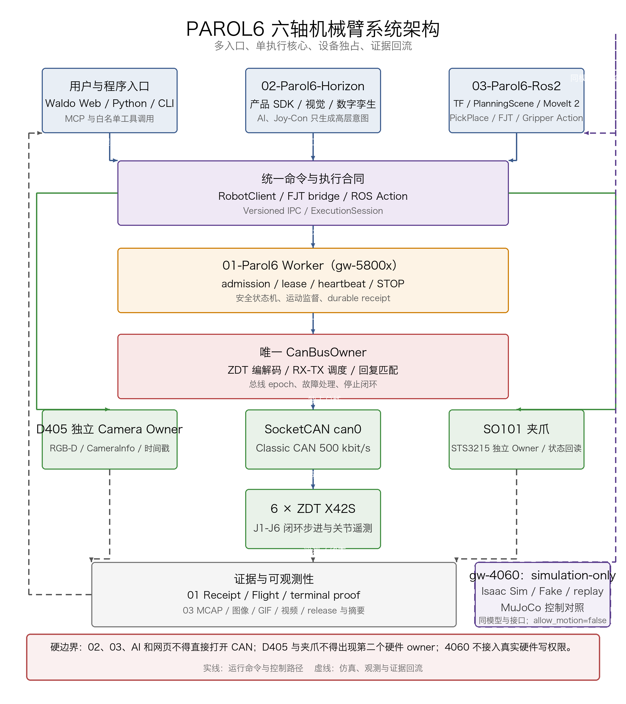
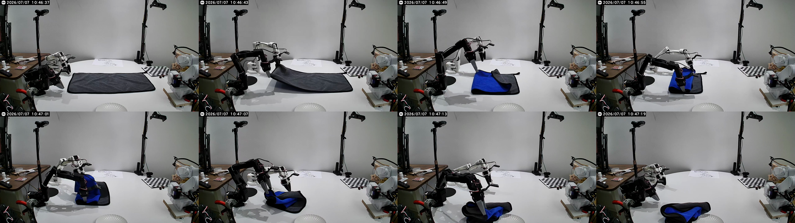
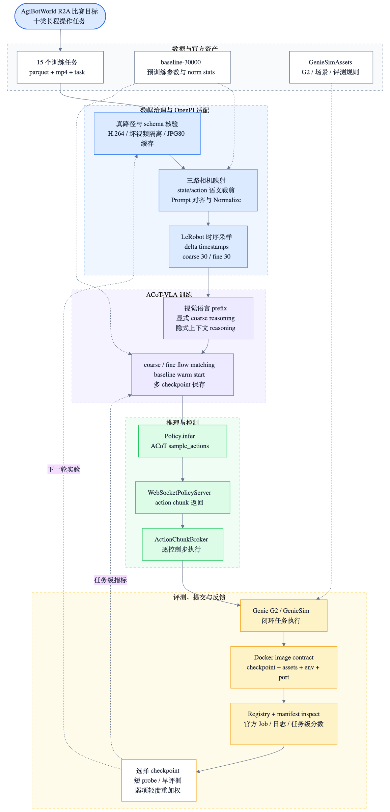
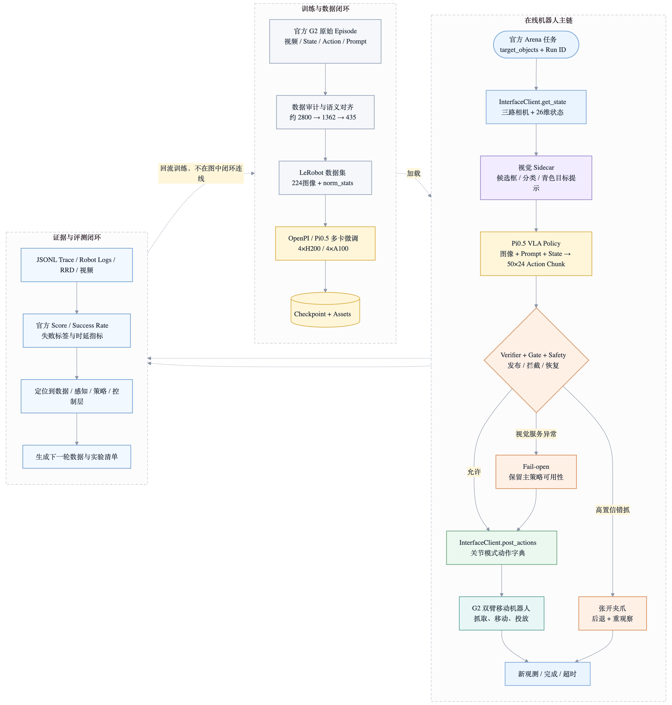

# 王泽瑜 · 个人作品集主页

五个项目详情页（TOP / PAROL6 / Evo-RL / ACoT-VLA / RoboChallenge-G2）的静态展示主页，由 GitHub 仓库维护，push 到 `main` 后 GitHub Actions 自动构建并部署到 GitHub Pages。

## 在线地址

https://l2ktech.github.io/wzy-portfolio/

## 怎么编辑（直接改这个仓库即可）

| 想改什么 | 改哪里 |
| --- | --- |
| 姓名、角色、简介、头像、GitHub/LinkedIn/简历按钮 | `data/projects.json` 的 `hero` |
| 项目卡片（编号、分类、标题、简介、标签、视频/封面路径） | `data/projects.json` 的 `projects` |
| 项目详情正文（Markdown，含图片/视频/mermaid） | `content/projects/<id>.md` |
| 图片 / 视频素材 | `media/<项目id>/` 下替换同名文件 |

改完 `git add` → `git commit` → `git push origin main`，GitHub Actions 会自动构建并更新 Pages。

## 本地预览

```bash
node build.mjs        # 生成 dist/
npx serve dist        # 或任意静态服务器打开 dist/index.html
```

## 部署机制

`.github/workflows/deploy.yml`：push 到 `main` → `node build.mjs` 生成 `dist/` → `actions/deploy-pages` 部署到 Pages。Pages 源设置为 "GitHub Actions"。

## 媒体与内容边界

- 只包含用于公开展示的项目媒体（视频、架构图、过程图、头像）。
- 简历/面试私密资料、内部文档、账号信息**不进入本仓库**。
- 项目指标与证据边界以各项目正文表述为准，详情页优先做作品集展示，不替代详细技术文档。

---

## 项目媒体预览

### 01 · TOP 双五轴镜像测厚
<video controls muted playsinline preload="metadata" poster="media/top/13_dual_head_axis_layout.png" src="media/top/five-axis-control.mp4"></video>



### 02 · PAROL6 六轴机械臂
<video controls muted playsinline preload="metadata" poster="media/parol6/hero.png" src="media/parol6/parol6-nostamp.mp4"></video>



### 03 · Evo-RL 毛巾折叠
<video controls muted playsinline preload="metadata" poster="media/evo-rl/d0-ep00-success-xiaomi-contact.png" src="media/evo-rl/evo-rl-cropped.mp4"></video>



### 04 · ACoT-VLA 多任务仿真训练
<video controls muted playsinline preload="metadata" poster="media/acot-vla/three-view-demo-poster.jpg" src="media/acot-vla/vr-clean-desktop-3view-demo.mp4"></video>



### 05 · RoboChallenge G2 真机抓取
<video controls muted playsinline preload="metadata" poster="media/robochallenge-g2/system-overview.png" src="media/robochallenge-g2/grasp-success.mp4"></video>


