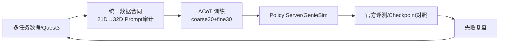

# ACoT-VLA · 多任务仿真训练

> **一句话定位**：在 AgiBotWorld R2A / GenieSim 上把 15 任务的数据与控制合同对齐（21D 语义→32D 模型接口），用 ACoT / Flow Matching 训练并经 Policy Server 接入官方评测；以真实任务表现选 checkpoint，Quest 3 链把示教转为结构化训练数据。

**硬指标**：`all_15 round1` 最佳已评 **4K = 0.389**（`9999=0.185 / 16K=0.173 / 19999=0.152`，越训非越好，无公开榜单不报排名）。Quest 3 留存 **42 eps / 126 MP4 / ~13GB**。

## 架构 · 数据合同优先

难点不在换模型，而在**训练与推理的输入输出语义一致**。

## 3 个关键技术决策

### 1) 数据合同 — shape 对≠语义对

- **问题**：三路视觉 + 183D/159D `state` + 40D 原始 `action` + 21D 实控 + `padding`，左右臂顺序/`rad/deg`/绝对-相对/`Prompt`/`norm stats`/`denorm` 任一错位，程序仍跑但行为已错。
- **选择**：收敛为统一数据合同，训练与评测前机械检查；对齐图像/`state`/`action`/维度/单位/`Prompt`/`norm` 与后处理。
- **证据**：[三视角海报](media/acot-vla/three-view-demo-poster.jpg) / [VR 示教成片](media/acot-vla/vr-clean-desktop-3view-demo.mp4)

### 2) 以任务表现选 checkpoint — 短 probe + 高频保存

- **问题**：默认“训越久越好”不成立。
- **选择**：短 `probe`、高频保存、尽早 `rollout`，用官方评测而非 `loss` 选型。
- **数据**：`4K 0.389` 为当前最佳已评，后续 `ckpt` 单调下降，验证“早停优于久训”。

### 3) Quest 3 结构化落盘 — 坐标与同步进流程

- **问题**：控制器映射、通信延迟、`state/action`/视频同步任一环节错即污染数据。
- **选择**：`Quest3 → WebXR → WebSocket → UDP → GenieSim` 全链路；录后 `inspect` + 三路视频检查 + `accept/reject` + LeRobot 转换进固定流程。

## 量化结果

| 项 | 结果 | 备注 |
|---|---|---|
| `all_15 round1` 最佳已评 | **4K = 0.389** | 官方评测，非 `loss` |
| 同任务其他 ckpt | 9999 0.185 / 16K 0.173 / 19999 0.152 | 越训非越好 |
| Quest 3 留存 | 42 eps / 126 MP4 | 结构化验收后 |

## 边界与可迁移

- 15 任务为仿真域，`sim2real` 与真机鲁棒性不在本项目口径内。
- OpenPI/ACoT/Pi0.5/GenieSim/LeRobot 为上游框架，本项目价值在合同对齐与评测闭环。
- 可迁移：多任务数据合同设计、`norm`/`denorm` 一致性保障、以任务表现驱动的 `checkpoint` 策略、示教数据结构化验收流程。

> 深度文档：`content_out/P05-Acot/03-VLA比赛ACoT-VLA与RoboChallenge技术主文档.md`
