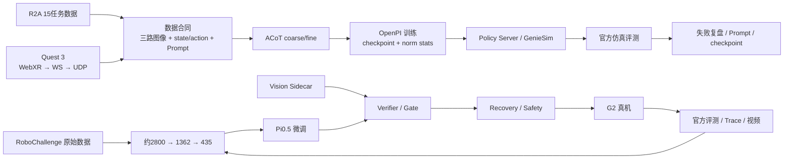
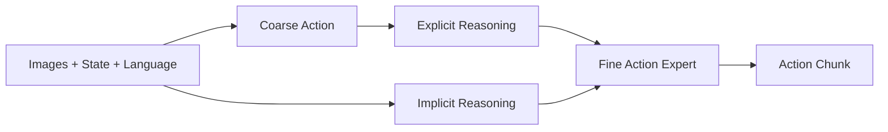
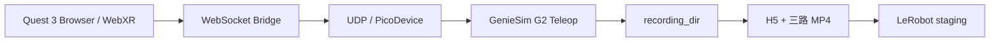
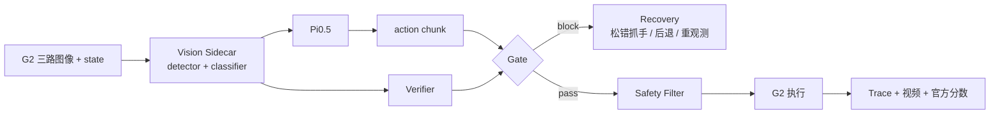

这是一个从 **多任务 VLA 仿真训练 → Quest 3 示教采集 → G2 真机部署与官方评测** 连起来的完整机器人学习项目。前半段在 AgiBotWorld R2A / GenieSim 中解决数据合同、ACoT 训练和 checkpoint 选择；后半段在 RoboChallenge G2 真机中继续解决数据治理、Pi0.5 微调、视觉确认、动作安全和失败恢复。

我没有把 OpenPI、ACoT、Pi0.5、GenieSim 或 LeRobot 包装成自己的原创模型。我的工作重点是把这些上游能力真正接成 **可训练、可执行、可评测、可复盘** 的机器人系统。

<figure>

<figcaption>项目主线：R2A / ACoT 仿真训练、Quest 3 示教采集，以及 RoboChallenge G2 真机闭环。</figcaption>
</figure>

## 一页看懂这个项目

- **R2A / ACoT-VLA**：15 个任务，三路视觉 + state/action + Prompt 数据合同，ACoT coarse/fine 两级动作，经 OpenPI、Policy Server、GenieSim、Docker 进入官方评测。
- **Quest 3 示教**：WebXR → WebSocket Bridge → UDP/PicoDevice → GenieSim G2，同步记录 state、action、任务元数据和三路视频，再转换成 LeRobot 数据。
- **RoboChallenge G2**：从约 2800 条候选数据治理到 435 条高质量双手主集，Pi0.5 微调后接入 Vision Sidecar、Verifier、Gate、Recovery、Claim 和 Safety Filter。
- **关键结果**：R2A `all_15 round1` 最佳已评 checkpoint 为 **4K = 0.389**；RoboChallenge 单目标官方评测 **79 分 / Success Rate 0.6 / 11 rollouts**。
- **关键负结果**：R2A 继续长训后分数持续下降；RoboChallenge 双目标线即使目标检测很强，13 次 rollout 仍只有 1 次完整成功，说明瓶颈不只在视觉检测。



## R2A / ACoT-VLA：从数据合同到官方评测

R2A 不是单一抓取任务，而是一组包含开门、放置、倒料、整理和连续分拣的多任务机器人操作。这里最容易出问题的并不是数组维度，而是 **shape 正确但动作语义错误**。

实际链路中需要同时对齐：

- head / left wrist / right wrist 三路图像；
- 原始 state 183D / 159D 与 action 40D；
- 真正参与控制的 21D 动作语义，再 pad 到模型接口的 32D；
- 左右臂字段顺序、rad/deg 单位；
- 绝对/相对 action 解释；
- Prompt；
- norm stats、delta mask、denorm 与动作后处理。

训练端、Policy Server 和 GenieSim / 官方评测端必须共享同一个合同。只要其中一端字段顺序、单位或 Prompt 不一致，程序仍可能正常运行，但机器人行为已经错了。

### ACoT：先粗动作，再生成精细动作

ACoT 的 coarse action 不是自然语言思维链，而是动作空间中的低频参考。项目中 coarse / fine 都使用 30-step horizon：coarse 先表达较长时间尺度的动作结构，fine expert 再结合视觉、语言和粗轨迹生成连续执行动作。



这里使用的是上游 ACoT / OpenPI 结构，我负责比赛任务的数据适配、训练配置、checkpoint、推理服务和官方评测闭环。

## 最重要的 R2A 实验：训练更久反而更差

`all_15 round1` 的官方评测结果：

- **4K：0.389**
- **约 10K（9999）：0.185**
- **16K：0.173**
- **约 20K（19999）：0.152**

这组结果不能简单归因为“就是过拟合”，因为多任务干扰、Prompt mismatch、灾难性遗忘等因素没有做完严格单变量消融。但它足以说明一件事：**机器人策略不能默认最后 checkpoint 最好。**

因此训练策略后来改成短 probe、高频保存、尽早 rollout，并以 per-task 分数和失败视频做模型选择，而不是只看 training loss。

后续又进一步把 Prompt 从早期 mixed-prompt 尝试收口为：官方 canonical Prompt map、task alias 归一化和 strict audit。训练开始前先机械检查 Prompt 合同，发现 unmapped alias 或脏字符串就直接终止，避免“代码能跑、loss 也下降，但任务条件本身错了”的白训。

当前历史资料仍缺部分外部 baseline / assets 和数据资产，所以这条线可以复核代码、流程和结果，但我不会把现有公开目录描述成“一键从零完整复训”。

## Quest 3：把人的操作变成结构化示教数据

Quest 3 支线的目标不是做一个 VR Demo，而是验证能否让操作者低成本控制 GenieSim 中的 G2，并把这次操作自动沉淀成后续 VLA 可以消费的数据。

<video controls playsinline preload="metadata" poster="/portfolio/acot-vla/three-view-demo-poster.jpg" src="/portfolio/acot-vla/three-view-demo.mp4"></video>

<figcaption>Quest 3 → GenieSim G2 三视角仿真示教。它证明采集链实际运行，不是真机，也不单独证明模型提分。</figcaption>



<figure>

<figcaption>Quest 3 Bridge 实际运行画面：WebXR 控制器数据经 Bridge 转发到 GenieSim teleop。</figcaption>
</figure>

采集链中真正需要处理的是：

- Quest reference space 到仿真世界 / G2 末端坐标的映射；
- Browser → WebSocket → Bridge → UDP → simulation step 的延迟、jitter 和失联恢复；
- state、action、head、left wrist、right wrist 和任务元数据的时间同步；
- 录制后的数据验收，而不是“文件存在就算有效”。

因此每条数据先走：

```text
recording_dir
→ inspect
→ frame / coverage / 三路视频检查
→ accepted / rejected
→ convert
→ LeRobot staging dataset
```

最终确认留存 **42 episodes / 42 H5 / 126 MP4 / 约 13 GB**。这些数字证明示教采集链跑通；因为没有完成严格的加入/不加入受控训练实验，所以不把它直接写成“提升了多少官方分数”。

## RoboChallenge G2：从训练模型推进到真机系统

真实超市货架比仿真更复杂：饮料外观相似、存在同类多实例和遮挡，机器人还要从启动区移动到货架、抓取、再移动到推车投放。双目标任务进一步增加左右手、两个实例、已持物状态和双臂碰撞问题。

<video controls playsinline preload="metadata" poster="/portfolio/robochallenge-g2/grasp-success.png" src="/portfolio/robochallenge-g2/grasp-success.mp4"></video>

<figcaption>官方任务环境中的一次成功抓取。它证明这段真机闭环发生过，不代表所有 rollout 或双目标任务。</figcaption>

### 数据治理：约 2800 → 1362 → 435

行为克隆会认真学习监督数据，所以 Prompt 与真实动作冲突不是“小噪声”，而是在明确教模型做错事。

项目中处理过的典型问题包括：

- Prompt 指定 7UP，实际动作抓 Pepsi；
- 把 Prompt 中 A/B 的文本顺序错误映射成左右手；
- 夹爪 close 但实际上没有持物；
- 成功后保留长时间静止、抖动或回位尾部；
- 同类双目标第一次抓取后错误隐藏整个类别；
- 三路视频与 state/action 时间错位。

最终数据逐层收紧：

```text
约 2800 条转换候选
→ 1362 条可追溯 RAW 数据
   ├─ 711 双手双目标
   └─ 651 单手单目标
→ 435 条高质量双手主集
→ 435 episodes / 830003 frames / 1305 videos
```

435 数据已经形成标准 LeRobot 训练 repo，并包含 norm stats。它是 5 月 20–21 日之后针对真实失败继续推进的优化线，**不能倒推成“435 条数据训练出了前面的 79 分”**。

### 固定训练 / 推理视觉合同

435 clean 数据的 224 训练视图固定为：

- `head_color`：整帧直接缩放到 224×224；
- `hand_left_color`：中心方形 crop → 224×224；
- `hand_right_color`：中心方形 crop → 224×224。

在线官方评测则从 Robot API 获取三路 JPEG，当前链路使用更高分辨率帧后在 policy 内执行同样的 head / wrist 几何预处理，再进入 Pi0.5。这样尽量减少“训练时看的是一种几何，推理时看的是另一种几何”的分布差异。

<figure>

<figcaption>head / 左腕 / 右腕三路图像是策略和视觉旁路的主要观测来源。</figcaption>
</figure>

### Pi0.5 与 4×H200 训练工程

正式 dual435 续训记录使用：

- **435 episodes / 830003 frames**；
- **4 × H200**；
- batch size **192**；
- **5000** train steps；
- 每 **625 step** 保存 checkpoint。

训练不是租到 GPU 就直接跑，而是拆成：

```text
preflight
→ debug_train
→ small real-data smoke
→ formal H200 training
→ checkpoint upload / cleanup
```

这样可以在昂贵 GPU 开机前先发现数据、norm stats、baseline、网络、磁盘和环境问题。

## Vision Sidecar：为什么 VLA 外面还要再做视觉确认

真机失败表明：**目标在画面里可见，不等于 VLA 一定选对那个物理实例。**

因此主策略外增加了独立 PyTorch Vision Sidecar。JAX/OpenPI 主进程保持稳定，YOLO detector / classifier 在另一个进程中运行，通过本地 HTTP 接口返回候选框、类别和置信度。

<figure>

<figcaption>主策略负责动作，Sidecar / Verifier / Gate / Recovery 负责把感知证据与真机执行安全接起来。</figcaption>
</figure>



### Verifier / Gate / Recovery / Claim

Verifier 不只返回 True/False，而是保留 `verdict + confidence + evidence`，例如 match / mismatch / uncertain。远程视觉服务异常也不会被伪装成“目标正确”，而是作为 uncertain/error evidence 进入上层决策。

身份确认主要集中在真正准备抓取的 close phase，而不是每个控制周期都硬判一次。实际运行策略逐步从 log-only 收集证据，发展到只在高置信错误时改变动作：

- 抓前 target match 使用高阈值；
- 高置信非目标 mismatch 才触发 Gate；
- 如果能判断错抓侧，Recovery 只松开那只手，保护另一只已经抓对的手；
- Claim 确认某只手已经持有目标后，下一轮给 VLA 的 Prompt 聚焦剩余目标；
- Head guide 的低置信候选只记录，不直接拿来控制；
- pre-close height guard 有实现，但在缺少可靠真实 FK 字段时保持关闭，而不是假装已经提供安全保证。

这套设计的原则是：**低置信感知用于观察和记录，高置信抓前证据才允许改变真实机器人动作。**

## 官方单目标评测：79 分是怎么来的

2026-05-09 官方 `grasp_the_drink` 评测共有 **11 个 rollout，总分 79，页面 Success Rate 0.6**。

分数可核算为：

```text
4 × 10
+ 2 × 9.5
+ 2 × 7
+ 2 × 3
+ 1 × 0
= 79
```

评分本身也能帮助定位系统能力：

- **10 分**：移动到货架 + 正确抓取 + 返回推车并投放完整完成；
- **9.5 分**：完整完成，但发生重试；
- **7 分**：整体移动/投放链跑通，但抓错相似饮料；
- **3 分**：移动和停靠成功并进入抓取流程，但没有完成抓取；
- **0 分**：失败。

这说明系统已经能完成真实移动、停靠、抓取和投放闭环，但相似目标语义和抓取稳定性仍是主要问题。

## 双目标负结果：检测强，不代表任务成功

双目标研究线记录为：

- **35.5 分**；
- **13 rollouts**；
- **1 次完整成功**；
- wrong object、missing second、collision 和 machine fault 都出现过。

与此同时，一条离线视觉统计中平均约 **7.31 boxes/frame**，目标平均置信度约 **0.9859**。这组反差很重要：

> **目标可见 ≠ VLA 理解任务 ≠ 选对物理实例 ≠ 第二目标状态正确 ≠ 双手时序正确 ≠ 最终安全完成。**

所以后续优化没有继续把所有问题都归结为 detector，而是推进到实例状态、Claim、第二目标 Prompt、Gate 时机、Recovery 和双臂安全。

## 这个项目最终沉淀下来的工程方法

- **数据合同优先于模型堆叠**：字段、单位、Prompt、norm stats 和 action 语义先对齐。
- **官方/真机 rollout 优先于 training loss**：模型选点最终看机器人完成了什么。
- **先做小 probe，再扩大训练**：R2A 的 4K→20K 退化直接改变了 checkpoint 策略。
- **数据质量不是“清洗画面”**：BC 中冲突示范会被模型真实学进去。
- **视觉可见性不等于任务语义**：检测、实例选择、状态管理、控制和安全必须分层检查。
- **失败必须可追溯**：视频回答“发生了什么”，Trace 回答“系统为什么这样决定”。
- **模块存在不等于正式启用**：实验功能、log-only、gate、默认关闭的安全项需要明确区分。

## 代码与项目真源

- [AgiBotWorld / R2A / Quest 3 工程仓库](https://github.com/l2ktech/agibot-root)
- [RoboChallenge G2 工程仓库](https://github.com/l2ktech/37-RoboChallenge)
- [RoboChallenge Vision Sidecar](https://github.com/l2ktech/37-RoboChallenge/blob/main/RoboChallenge-icra2026/robochallenge_inference/vision_service_server.py)
- [RoboChallenge Verifier](https://github.com/l2ktech/37-RoboChallenge/blob/main/RoboChallenge-icra2026/robochallenge_inference/verifier.py)
- [dual435 224 数据转换](https://github.com/l2ktech/37-RoboChallenge/blob/main/RoboChallenge-icra2026/scripts/dual435/convert_dual435_raw_to_vla224.py)

这些仓库保留原始代码、实验和证据；本页只把项目中已经确认的主线、结果与技术边界整理成对外可读版本。