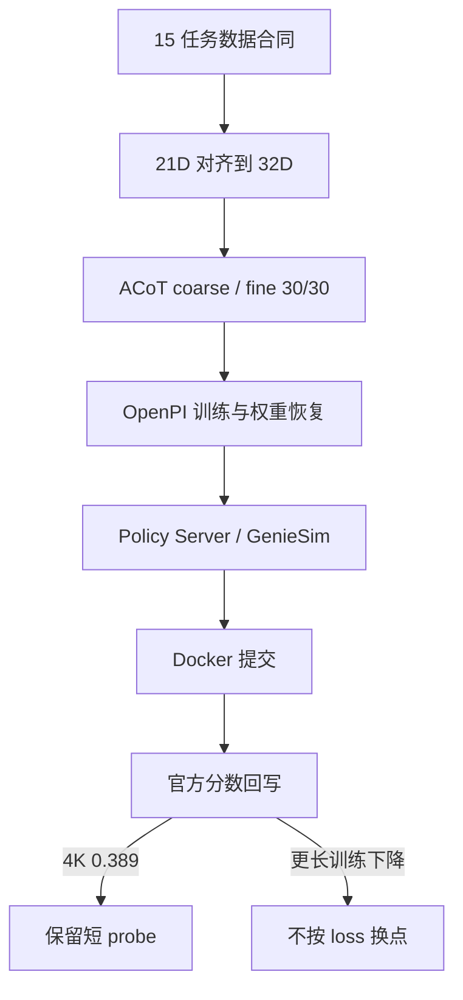

这是一条竞赛工程链，不是单次模型演示。15 个任务先把动作从 21 维对齐到 32 维，ACoT 按 coarse / fine 各 30 步生成动作，再经 OpenPI、Policy Server、GenieSim 和 Docker 送进官方评测。选点用官方分数，不用 loss。
<figure>

<figcaption>系统总架构：数据合同、ACoT 动作、训练恢复和官方评测。</figcaption>
</figure>
## 数据、动作和评测怎么接

Quest 3 到 GenieSim 的 VR 采集链还在：原始 episode、H5 和三视角视频被转成 LeRobot 格式，用来补弱项和查数据质量。下面的三视角演示属于仿真示教，不是真机抓取。
<video controls playsinline preload="metadata" poster="/portfolio/acot-vla/three-view-demo-poster.jpg" src="/portfolio/acot-vla/three-view-demo.mp4"></video>
<figure>

<figcaption>Quest 3 采集桥接实况：头显视角的工作台场景与桥接状态。</figcaption>
</figure>
## 训练里实际发生了什么
all_15 第一轮官方评测里，4K checkpoint 是 0.389。继续训到大约 10K、16K、20K，分数变成 0.185、0.173、0.152。所以后来改成短 probe、早评测，保住已经强的任务，弱项只做轻度重加权。当前工作区缺一批外部资产，代码能读、流程能讲，但不能说现在能一键重训。
## 现在能确认的结果
4K 的 0.389 是这条线上最清楚的官方数字。更长训练没有更好。仿真示教、榜单排名和真机抓取是三件不同的事，这里只把竞赛闭环和选点依据讲清楚。
