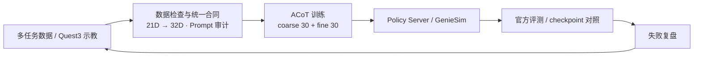

这是一个把 **多任务 VLA 仿真训练和 Quest 3 示教采集**连起来的机器人学习项目。前半段在 AgiBotWorld R2A / GenieSim 中训练和评测 ACoT-VLA，后半段用 Quest 3 把人类操作转成后续训练能用的结构化数据。

项目覆盖**数据合同与任务适配、训练配置、checkpoint 评测、Quest 3 示教链**。OpenPI、ACoT、Pi0.5、GenieSim 和 LeRobot 为上游框架或模型，系统重点是把它们接成一条能训练、能评测、能迭代的链路。

## 项目由两部分组成

### 1. R2A / ACoT-VLA 多任务仿真训练

在 15 个机器人操作任务上对齐三路图像、state / action、Prompt、动作维度、单位、norm stats 和推理后处理，并通过 OpenPI Policy Server 接入 GenieSim / 官方评测。

### 2. Quest 3 示教采集

通过 WebXR、WebSocket Bridge 和 UDP 把 Quest 3 控制器动作映射到 GenieSim G2，同时记录 state、action、任务元数据和三路视频，再转换成后续训练可以使用的 LeRobot 数据。

**Quest 3 三视角示教实录 · Sort packages**（640×400 头部 + 2×1280×1056 双手，30 fps）

**Quest 3 三视角示教实录 · Clean the desktop**

## 主要工作

- 对齐多任务训练和官方评测的数据合同；
- 处理图像、state/action、动作维度、单位、Prompt、norm stats 和后处理一致性；
- 组织短 probe、checkpoint 保存和 rollout 评测，避免只看 training loss；
- 搭建 Quest 3 → WebXR → WebSocket → UDP → GenieSim 的示教链；
- 对录制数据做 inspect、三路视频检查、accept / reject 和 LeRobot 转换。

## 系统怎么工作

**多任务数据 / VR 示教 → 数据检查与统一合同 → ACoT 训练 → Policy Server / 官方评测 → 失败复盘 → 回到数据和训练**

项目最难的地方不在换哪个模型，而在让**训练时的数据语义、推理时的输入输出保持一致**。

## 关键工程工作

### 1. 数据 shape 对了，不代表动作语义对了

R2A 链路同时包含三路视觉、183D / 159D state、40D 原始 action、实际参与控制的 21D 动作以及模型接口需要的 padding。左右臂顺序、rad / deg、绝对/相对动作、Prompt 和 denorm 只要有一处错位，程序仍然可能正常运行，但机器人行为已经错误。

因此这些约束被收敛为统一数据合同，并在训练和评测前做机械检查，避免等真机表现异常后再回溯排查。

### 2. 最后一个 checkpoint 不一定最好

R2A `all_15 round1` 官方评测中：

- **4K：0.389**；
- **9999：0.185**；
- **16K：0.173**；
- **19999：0.152**。

继续训练并不自动带来更好策略，因此评测流程改为短 probe、高频保存和尽早 rollout，以真实任务表现选择 checkpoint，而不是默认训练越久越好。

### 3. Quest 3 把示教变成结构化数据

Quest 3 线最终确认留存 **42 episodes / 42 H5 / 126 MP4 / 约 13 GB**。重要的是控制器坐标映射、通信延迟、state/action/视频同步，以及录制后的数据验收都进了固定流程。

## 项目结果

- AgiBotWorld R2A 15 任务 `all_15 round1` 官方评测 checkpoint：**4K = 0.389**；
- Quest 3 示教链：**42 episodes / 126 路视频文件**完成验收留存。

## 技术栈

**ACoT-VLA · OpenPI · LeRobot · AgiBotWorld R2A · GenieSim · Quest 3 / WebXR · JAX / PyTorch · 多模态机器人学习**
