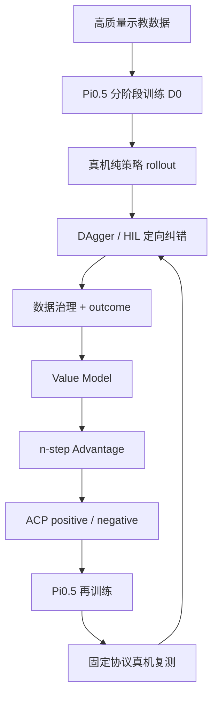

SO101 双臂在真实桌面环境中完成毛巾抓取、折叠、对齐和放入托盘。项目使用 **Pi0.5 + LeRobot** 作为基础 VLA / 机器人学习栈，重点不是做一次成功演示，而是把 **分阶段示教训练、真机 rollout、HIL 定向纠错、Value / Advantage / ACP 再训练、工程排障和固定协议复测**串成可持续迭代的真机学习闭环。

当前已经验证的是 **Level 1：毛巾初始状态相对平整**。D0 纯策略固定流程测试为 **6/10**；经过定向纠正和改进训练后，新的纯策略批次为 **7/10**。两组都只有 10 次，因此这里不把结果外推成长期稳定的 60% / 70%，也不把 6/10 → 7/10 的变化归因给某一个单独模块。

<figure>
<video controls muted playsinline preload="metadata" poster="/portfolio/evo-rl/d0-ep00-success-xiaomi-contact.png" src="/portfolio/evo-rl/d0-success.mp4"></video>
<figcaption>D0 纯策略完整折叠成功回合。单回合用于展示任务形态，能力结论仍以连续 rollout 为准。</figcaption>
</figure>

## 项目主线



这里的实际基础策略一直是 **Pi0.5**。训练闭环参考了“基础策略先获得能力，再从真机经验和人工纠错中继续学习”的思路，但没有把其他闭源 VLA 权重冒充成项目实际模型。

## D0：长任务不是一次训练出来的

完整毛巾折叠包含多次抓取、转场和双臂协同。我先把长任务拆开，再通过 warm-start 把能力逐段连接起来。

- **P1：双臂抓两角合拢**：50 episodes / 21,146 frames，1000 steps，到可用 checkpoint 约 6.5 h。
- **P1+P2：连续完成前两段**：36 episodes / 19,292 frames，1000 steps，约 6.5 h。
- **新双臂 P3：折成更小形态**：50 episodes / 14,957 frames，1000 steps，约 6.6 h。
- **P2+P3：专门学习阶段转场**：25 episodes / 14,429 frames，1000 steps，约 6.6 h。
- **P3+P4：折叠后抓起并放入托盘**：25 episodes / 14,302 frames，约 6.6 h。

前五段递进训练累计 wall time 约 **35 h**。早期我尝试过单左臂 P3，但真机表现不稳定，因此没有继续堆训练，而是重新录制成双臂 P3。

最后再使用 **50 个完整任务 episode / 58,292 frames**，从 P3+P4 权重 warm-start，训练 2000 steps 的完整 D0，使策略不需要人工切换阶段 prompt 就能连续执行整个任务。固定流程测试得到 **6/10** 的纯策略基线。

<figure>

<figcaption>另一条 D0 成功回合。项目保留成功和失败回合，而不是只挑选最好看的片段。</figcaption>
</figure>

## 相对动作：先把动作表示对齐

后续微调采用相对动作思路。绝对动作直接预测目标状态，相对动作表达“相对当前状态还要移动多少”：

```text
a_rel = a_abs - q_t

a_abs = a_rel + q_t
```

它的主要价值是让微调和 Pi0.5 / OpenPI 的动作表示更一致，并降低对绝对零位和小初始偏差的敏感性。它不是万能的误差修复机制，也不能自动消除连续执行中的累计误差。

## HIL / DAgger：专门采当前策略真正会犯错的状态

普通成功示教主要覆盖“人会怎么正确完成任务”，但部署后的策略会进入原始示教中很少出现的状态。我的做法是让策略自己执行，只有在即将抓错、折偏、碰撞或进入明显失败状态时才短暂人工接管，然后把控制权交还给策略。

每一帧同时保存：

- 当前多相机 observation 和 robot state；
- `policy_action`：策略原本想执行的动作；
- `action`：实际执行动作；
- `is_intervention`：该帧是否人工介入；
- episode 级 success / failure outcome。

<figure>

<figcaption>HIL 介入片段。这里证明的是“策略偏离被发现、纠正并保存”，不是策略已经自主恢复。</figcaption>
</figure>

代表回合中 1,151 帧里有 130 帧介入，即 **11.29%**；介入区间 `|action-policy_action|` 明显高于非介入区间。这使纠错数据可以被审计，而不是只有“人帮它完成了任务”这样的模糊描述。

## Value Model：把轨迹成败变成逐状态学习信号

Evo-RL 主线中，我没有直接把 success / failure 当成动作标签，而是先训练一个 Value Model，估计当前状态在给定任务下距离成功还有多好。

Value 输入包括 **多相机图像、任务文本和 robot state**。监督 target 不是人工逐帧标注进度，而是依据 episode 的成功/失败、当前帧位置和剩余步数自动构造：成功轨迹越靠近终点越接近 0；失败轨迹额外加入 failure penalty，最后归一化到 `[-1, 0]`。

当前 Value stack 采用：

- **SigLIP**：编码多相机视觉；
- **Gemma 3 270M**：编码 task 与离散化后的 robot state；
- 图像特征与语言/状态特征融合；
- Value Head 在 `[-1, 0]` 上输出 **201 个 value bins**；
- 将标量 target 投影到相邻 bins，使用 distributional cross-entropy 训练，再从分布期望恢复 `V(s)`。

<figure>

<figcaption>Value 估计叠加到机器人视角，用于检查模型是否随任务进展形成合理的状态价值变化。Value 是诊断和训练信号，不等于成功率。</figcaption>
</figure>

## Advantage → ACP → Pi0.5 再训练

Value Model 对整条 HIL / rollout 数据推理后得到逐帧 `V(s)`，再使用 episode 内的 n-step 时序变化计算 Advantage。项目使用 50-step 窗口，并严格在 episode 边界截断，避免跨回合拼接。

直觉上，如果一段动作让后续状态明显变好，它应得到更高的 Advantage。随后按同一任务中的 Advantage 分布划分 **positive / negative ACP**，并把质量条件追加到任务文本：

```text
fold the towel into a compact square and place it in the tray
Advantage: positive
```

或：

```text
Advantage: negative
```

然后继续训练 Pi0.5；推理时要求 positive 条件。这个阶段本质上仍然是**带轨迹质量条件的离线监督策略学习**，不是让机械臂在真机上随机探索整套毛巾折叠。

完整的实际 Evo-RL 链路是：

```text
D0 rollout
→ HIL 定向纠错
→ Value Model
→ Advantage
→ ACP positive / negative
→ Pi0.5 再训练
→ 真机重新评估
```

## 两个最重要的真机工程问题

### 1. 程序不报错，但机器人几乎不动

一次部署中，checkpoint 能正常加载、API 和 tensor shape 都正常，但机器人动作幅度接近零。我没有立即重训，而是把动作链拆成：

```text
raw model output
→ postprocessor
→ action_to_send
→ sent_action
```

同一个 checkpoint、同一份 processed observation，只改变推理环境，旧环境里的 raw action 几乎坍缩；换回与训练兼容的 torch / transformers 环境后动作幅度恢复。

这个问题最后沉淀成固定排障顺序：**先查模型原始输出，再查 processor，再查发送链，最后才判断 checkpoint 是否训练失败。**

### 2. 真机突然下坠或大幅跳一下，然后继续动作

更危险的一次问题是抓取过程中机械臂会突然向下掉或产生大幅跳变。单纯调小 `max_relative_target` 没有解决根因。

关键对照是：同一个 checkpoint 在正确离线推理链中动作基本正常，而异常真机记录里出现过：

- 最大 `action - state`：**327.42**；
- 最大相邻帧 action jump：**273.62**。

因此问题定位方向转向了**实际 runtime action processing / 启动路径 / record-send chain 和正确离线路径不一致**，而不是简单判定“模型整体坏了”。之后增加了启动前离线 action gate、运行参数和实际发送动作日志，并把动作限幅只作为最后一道安全兜底。

工程原则是：**限幅可以阻止一次危险的大动作，但不能替代上游根因修复。**

## 如何判断模型真的变好了

我把以下四种状态严格分开：

```text
训练完成
≠ checkpoint 已正确传输
≠ 服务可以加载并返回动作
≠ 真机能力成立
```

最终能力必须由固定条件下、无人接管的真机 rollout 判断，而不是看 Loss、单条成功视频或 checkpoint 是否存在。

当前统一结果：

- **D0 纯策略：6/10**；
- **定向纠正和改进训练后的纯策略：7/10**。

这个结果只说明当前两批固定流程测试的方向是正的。由于每组只有 10 次，而且训练链同时包含数据筛选、相对动作、HIL、Value / ACP 等变化，没有严格单模块 ablation，因此不会写成“某一个模块稳定提升 10%”。

历史上也出现过 **ACP LoRA 0/5、FullFT 1K 0/10** 的负结果。它们保留在项目里，是因为训练曲线正常并不意味着真机能力会提高。这些失败促使后续进一步统一任务文本、初始状态、动作表示、推理环境和评估协议，而不是继续盲目堆训练步数。

<figure>

<figcaption>折叠接近完成时的外部视角。页面同时保留方法、失败和边界，而不是只展示成功。</figcaption>
</figure>

## SARM + RA-BC：另一条 progress / reward 路线

项目还训练和研究过 **SARM（Stage-Aware Reward Modeling）+ RA-BC**。它和 Value / ACP 的目标相近，都是利用轨迹质量信号改进模仿学习，但机制不同。

SARM 显式预测“当前处在哪个阶段 + 阶段内部进度”，形成 `0 → 1` 的任务 progress。RA-BC 再比较一个 action chunk 前后的 progress 增量：推进任务明显的 chunk 权重更高，停滞或倒退的 chunk 权重更低。

可以简化成：

```text
Value / ACP：状态价值 → Advantage → positive / negative 条件
SARM / RA-BC：阶段进度 → progress delta → BC loss 权重
```

因此 SARM + RA-BC 在本项目中作为**扩展算法路线和后续对照方向**，不把当前 7/10 结果单独归因给它。

## 后续范围：Level 2 与可选 RLT

当前完成的是 Level 1。下一层任务是 **Level 2：毛巾凌乱或随机摊开后，先找角、整理和展开，再进入折叠**。

RLT / Actor-Critic 不是必须继续做的下一步。如果剩余失败主要是数据覆盖不足，优先继续 HIL / 数据补充更直接。只有当基础策略已经知道大体怎么完成任务，但**重抓、边缘精对齐、失败恢复**这类局部连续精细控制仍然成为瓶颈时，才值得冻结大 VLA，只针对这些局部阶段做强化学习优化。

## 我在这个项目里最关注的东西

这个项目最终留下的不只是一个毛巾折叠模型，而是一套更可靠的真机学习工作方式：

- 长任务先拆能力、再 warm-start 合并，而不是一次性赌完整训练；
- 策略失败时采它真正访问到的状态，而不是只继续录理想示教；
- 人工纠正、策略原动作和实际发送动作必须同时可追踪；
- Value / Advantage / ACP 的训练信号要和真实 episode outcome 对齐；
- 训练环境和推理环境必须同源，action chain 要能逐级插桩；
- Loss、文件存在和 API 正常都不能替代真机结果；
- 负结果保留，因为它们能阻止错误结论继续向后传播。

**技术关键词：** SO101 · Pi0.5 · LeRobot · 双臂操作 · 相对动作 · DAgger / HIL · Value Model · Advantage · ACP · SARM · RA-BC · 真机评测 · action-chain debugging
