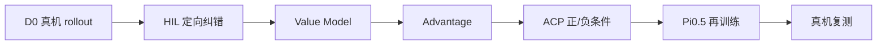

## 项目简介

这是一个 **SO101 双臂毛巾折叠的真机机器人学习项目**。两只 SO101 配三路相机，基础 VLA 策略使用 **Pi0.5**。当前任务限定在 **Level 1：毛巾初始状态相对平整**，让双臂连续完成抓边、折叠、对齐，最后把折好的毛巾放入托盘。

我的重点不是做一次成功 Demo，而是把 **分阶段训练、真机排障、DAgger/HIL 定向纠错、Value / Advantage / ACP 再训练和真机复测**串成一个可以持续迭代的闭环。

<figure>
<video controls muted playsinline preload="metadata" poster="/portfolio/evo-rl/d0-ep00-success-xiaomi-contact.png" src="/portfolio/evo-rl/d0-success.mp4"></video>
<figcaption>SO101 双臂完成完整毛巾折叠任务。单回合用于展示任务形态，最终能力仍以连续真机 rollout 判断。</figcaption>
</figure>

## 1. D0：先拆阶段，再合成长任务

完整毛巾折叠不是一次训练出来的。我先把长任务拆开，再通过 **warm-start** 逐段把能力连接起来：

**P1 抓两角合拢 → P1+P2 连续完成前两段 → 双臂 P3 → P2+P3 学转场 → P3+P4 折完后抓起并放入托盘。**

五个递进阶段的训练记录：

- P1：50 episodes / 21,146 frames，约 6.5 h；
- P1+P2：36 episodes / 19,292 frames，约 6.5 h；
- 双臂 P3：50 episodes / 14,957 frames，约 6.6 h；
- P2+P3：25 episodes / 14,429 frames，约 6.6 h；
- P3+P4：25 episodes / 14,302 frames，约 6.6 h。

前五阶段累计训练时间约 **35 小时**。早期我尝试过单左臂 P3，但真机不稳定，因此没有继续堆训练，而是重新录制成双臂 P3。

最后再录制 **50 个完整任务 episode / 58,292 frames**，从 P3+P4 权重 warm-start，进行 **2000-step Full D0** 训练，得到不需要人工切换阶段 prompt、可以连续执行完整任务的基础策略。固定流程测试 10 次，D0 纯策略结果为 **6/10**。

<figure>

<figcaption>D0 完整任务成功回合之一。</figcaption>
</figure>

## 2. 两个真机问题：先排动作链，再怀疑模型

这个项目中两个最重要的工程问题，都让我建立了同一套排障顺序：

```text
raw model output
→ processor / postprocessor
→ action_to_send
→ sent_action
→ 最后才判断 checkpoint 是否需要重训
```

### 程序不报错，但机器人几乎不动

一次部署中，checkpoint 能加载、API 正常、tensor shape 也正常，但机器人几乎不运动。

我用同一个 checkpoint、同一份输入，只改变推理环境做对照，发现旧环境中的模型原始动作幅值几乎坍缩；切回与训练兼容的 torch / transformers 环境后，动作恢复正常。

所以问题并不是“模型没学会”，而是 **训练环境和推理环境不一致导致了推理数值行为变化**。

### 真机突然下坠或大幅跳动

另一类问题更危险：抓取过程中机械臂会突然向下掉或产生一次很大的跳变，然后又继续执行。

异常真机记录里出现过：

- 最大 `action - state`：**327.42**；
- 最大相邻 action jump：**273.62**。

而同一个 checkpoint 在正确的离线推理链中动作基本正常，因此排查方向从“模型整体坏了”转向 **runtime action processing / 启动路径 / record-send 链与正确离线路径不一致**。

后续我增加了启动前 action gate、实际运行参数与 sent action 记录。`max_relative_target` 只保留为最后一道安全兜底，因为**限幅只能把错误动作夹小，不能修复上游为什么产生错误动作。**

## 3. 相对动作 + DAgger/HIL：专门补策略真正会犯错的状态

后续训练使用相对动作表示：

```text
a_rel = a_abs - q_t

a_abs = a_rel + q_t
```

它主要解决两件事：让微调时的动作表示和 Pi0.5 / OpenPI 更一致，并降低对绝对零位和小初始姿态偏差的敏感性。它不是自动消除累计误差的机制。

随后做 **DAgger/HIL 式纠错采集**：策略正常自己执行，只有快要抓错、折偏或进入明显失败状态时，人短时间接管，再把控制权交还给策略。

每一帧同时保存：

- observation / robot state；
- `policy_action`：策略原本想做什么；
- `action`：实际执行或人工纠正动作；
- `is_intervention`：是否人工介入；
- episode success / failure。

它的价值不是“人帮机器人完成任务”，而是采集**当前策略自己真正会访问到、但原始成功示教覆盖不足的失败状态**。

<figure>

<figcaption>策略偏离时人工短暂接管并保存纠正。这里证明的是 HIL 数据闭环，不是策略已经自主恢复。</figcaption>
</figure>

## 4. Evo-RL：Value → Advantage → ACP → 再训练 Pi0.5

实际使用的 Evo-RL 主线是：



### Value Model

Value Model 回答的是：**在当前任务下，这个状态离成功还有多好？**

输入包括多相机图像、任务文本和 robot state。Value target 不需要人工逐帧标进度，而是根据 episode 的 **success / failure、当前帧位置和剩余步数**自动构造：越接近成功终点越接近 0；失败轨迹额外加入 penalty，再归一化到 `[-1, 0]`。

当前 Value stack 使用：

- **SigLIP**：视觉编码；
- **Gemma 3 270M**：任务文本和离散化 robot state；
- 图像与语言/状态特征融合；
- Value Head 在 `[-1,0]` 上输出 **201 个 bins**，通过 distributional cross-entropy 训练。

<figure>

<figcaption>Value 在机器人视角上的可视化。它是状态价值估计和训练信号，不等于真实成功率。</figcaption>
</figure>

### Advantage 与 ACP

Value Model 跑过轨迹得到逐帧 `V(s)` 后，再根据一段时间内的 value 变化计算 **n-step Advantage**。如果一段动作让后续状态明显变好，它会得到更高的 Advantage。

随后按同一任务中的 Advantage 分布划分 **positive / negative ACP**，并把它作为 task 条件继续训练 Pi0.5：

```text
fold the towel into a compact square and place it in the tray
Advantage: positive
```

推理时使用 positive 条件。因此这条链更接近**利用真实轨迹质量做离线策略改进 / 条件模仿学习**，而不是让机器人在真机上从随机动作开始探索。

## 5. 真机结果与当前边界

最终判断模型是否变好，我只看**固定条件下、无人工接管的纯策略真机 rollout**，而不是训练 Loss 或单条成功视频。

当前统一结果：

- **D0 基线：6/10**；
- **定向纠正和改进训练后的纯策略：7/10**。

每组只有 10 次，所以我不会把它描述成长期稳定的 60% → 70% 成功率；同时改进链里包含数据筛选、相对动作、HIL、Value / ACP 等多个变化，没有严格单模块消融，因此也不把提升全部归因给某一个模块。

项目还训练/研究过 **SARM + RA-BC**：它通过 Stage / Progress 和 progress delta 改变 BC loss 权重；与 Value → Advantage → ACP 目标相近，但机制不同，因此作为独立扩展路线，不作为当前 7/10 的单独来源。

当前已验证范围仍然是 **Level 1 平铺毛巾折叠**。Level 2 会进一步处理凌乱、随机摊开的毛巾，需要先找角、整理和展开，再进入折叠。

**RLT 也不是必须继续做的下一步。** 如果剩余失败主要来自数据覆盖不足，我会优先继续 HIL + BC；只有当数据覆盖已经足够、局部连续精细控制仍然成为瓶颈时，才考虑在重抓、边缘对齐或失败恢复等局部阶段引入 Actor-Critic / RLT。