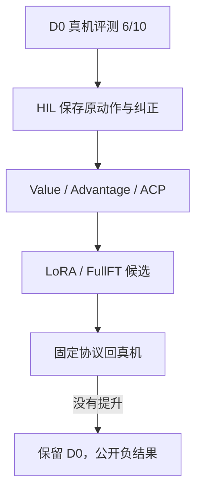

SO-101 双臂要在真实桌面上把毛巾折起来。先用 Pi0.5 基线定出 D0，再让人在失败时介入，同时记下原动作和纠正。这些回合被做成 Value / Advantage / ACP 训练信号，候选微调再回到同一套协议里复测。D0 是 6/10；LoRA 0/5、FullFT 0/10，所以候选没有替换基线。
<figure>

<figcaption>D0 成功回合的外部高清视角。</figcaption>
</figure>
<figure>

<figcaption>HIL 生效时的外部视角。画面里有人的纠正，所以它证明的是纠错数据被记下，不是模型已经能自己折完。</figcaption>
</figure>
## 系统怎么跑

数据合同比模型名字更重要：prompt、视频、state、action 和“这次到底有没有折完”必须对齐。HIL 回合里的成功，统计时要和自主成功分开。
<figure>

<figcaption>另一条 D0 成功回合。</figcaption>
</figure>
<figure>

<figcaption>双臂接触和折叠过程中的一帧。</figcaption>
</figure>
## 训练和复测
33,295 帧被送进 Value / ACP 流程。训练曲线可以说明优化还在走，但不能代替固定协议成功率。候选微调在复测里没有超过 D0，所以没有晋级。
<figure>

<figcaption>Value 估计叠加在机器人视角上的可视化，用来看评估信号长什么样。</figcaption>
</figure>
<figure>

<figcaption>折叠接近完成时的外部视角。</figcaption>
</figure>
## 现在能确认的结果
D0 自主成功是 6/10。HIL 代表回合和多相机记录还在。候选微调没有提升自主成功率。后续如果要换模型，仍然用同一套协议说话，而不是看演示是否好看。
