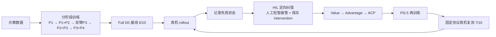

这是一个基于 **SO101 双臂 + Pi0.5** 的真机机器人学习项目。任务是在三路相机观测下，让两只机械臂连续完成毛巾抓边、折叠、对齐，并把折好的毛巾放入托盘。

项目覆盖**示教数据设计、分阶段训练、Pi0.5 部署、真机动作链排障、HIL 定向纠错、Value / Advantage / ACP 再训练以及固定协议真机复测**。项目重点不是放一段成功视频，而是把"发现失败 → 补数据 → 再训练 → 真机复测"的改进流程跑起来。

## 项目目标

长时序双臂操作比单次抓取更难。毛巾折叠过程中，前一个阶段的误差会直接影响后一个阶段，左右臂还需要保持配合；如果策略在某一步进入训练数据没有覆盖过的状态，后续动作很容易继续偏离。

因此项目重点解决三件事：

- 如何把长任务拆成更容易学习的阶段，再逐步合成长任务；
- 如何区分"模型没学会"和"部署/动作处理链出了问题"；
- 如何利用真机失败状态做定向纠错，而不是无目的地继续增加示教数据。

## 主要工作

- 设计并录制双臂毛巾折叠示教数据；
- 将完整任务拆成多个阶段，用 warm-start 逐步连接能力；
- 训练和部署 **Pi0.5 / LeRobot** 策略；
- 对 raw model output、processor、action_to_send、sent_action 做逐层动作链排障；
- 增加启动前 action gate、运行参数记录和实际 sent action 日志；
- 采集 DAgger / HIL 式人工短暂接管数据；
- 训练 Value Model，计算 Advantage，并构造 ACP 正/负条件；
- 用固定条件、无人工接管的真机 rollout 比较策略版本。

## 系统怎么工作

**示教数据 → 分阶段训练 → Full D0 基线 → 真机 rollout → 记录失败状态 → HIL 定向纠错 → Value / Advantage / ACP → Pi0.5 再训练 → 固定协议真机复测**

这条流程的核心：**先让真机暴露策略会犯什么错，再针对这些状态补数据和训练。**

## 关键工程工作

### 1. 先拆阶段，再合成长任务

完整毛巾折叠先被拆成抓边、前半折叠、双臂转场、后半折叠和放入托盘等阶段。前五个递进阶段累计训练约 **35 小时**，随后再录制 50 个完整任务 episode，并从前一阶段权重 warm-start 训练 Full D0，让策略不再依赖人工切换阶段 prompt。

D0 在固定流程下完成 **6/10** 次纯策略成功，成为后续改进的真实基线。

### 2. 先排动作链，再决定要不要重训

项目遇到过两类典型真机问题：checkpoint 能正常加载但机器人几乎不动，以及运行中突然出现大幅跳动。排查不直接归因于模型本身，而是按以下顺序逐层检查：

**raw model output → processor / postprocessor → action_to_send → sent_action → 真机执行**

最终发现过训练/推理环境不一致导致数值行为变化，也发现过 runtime action processing 与正确离线路径不一致的问题。实践中需要把**模型输出异常和执行链异常分开定位**。

### 3. HIL 只补策略真正会遇到的失败状态

策略正常情况下自己执行；只有快要抓错、折偏或进入明显失败状态时，人短时间接管并保存纠正，然后立即把控制权还给策略。

每一帧同时记录策略原本动作、实际执行动作、是否人工介入以及 episode 成败。这样得到的数据不是新的"完美示教"，而是专门覆盖当前策略自己会访问到的失败状态。

### 4. 用 Value / Advantage / ACP 做第二轮策略改进

Value Model 根据多相机图像、任务文本和 robot state 估计当前状态距离成功的质量，再通过轨迹上的 Value 变化计算 Advantage。之后把动作片段划分为 positive / negative ACP 条件，用于继续训练 Pi0.5。

这条路线更接近**利用真实轨迹质量做离线策略改进和条件模仿学习**，而不是让机器人在真机上从随机动作开始强化学习探索。

## 项目结果

固定条件、无人工接管的真机测试中：

- **D0 基线：6/10**；
- **定向纠错与改进训练后：7/10**。

当前验证范围为 **Level 1：初始状态相对平整的毛巾**；更凌乱的随机初始状态需要额外的找角、展开和失败恢复能力。

## 技术栈

**SO101 双臂 · Pi0.5 · LeRobot · OpenPI · 多相机视觉 · Imitation Learning · DAgger / HIL · Value Model · Advantage · ACP · Python / PyTorch**
