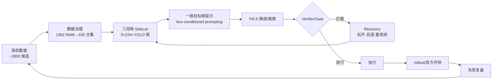

# RoboChallenge · G2 真机抓取

> **一句话定位**：密集货架取物中“看得见≠抓得对”，以真机数据治理为前提，用三视角 YOLO Sidecar 做一致 `box-conditioned prompting` 突出目标实例，经 Pi0.5 推理与 Verifier/Gate/Recovery 安全执行，并以官方 `rollout` 复盘定位失败。

**硬指标**：**2800 候选 → 1362 可追溯 RAW → 435 双手主集**治理；单目标官方 **79 分 / SR 0.6 / 11 rollouts**；双目标研究线 **35.5 分 / SR 0.1 / 13 rollouts**（瓶颈在相似实例选择与双手状态管理）。

## 架构 · 证据闭环

## 3 个关键技术决策

### 1) 先治理，再训练 — BC 会学错

- **问题**：`Prompt` 与真实抓取目标不一致、错误持物、静止尾段、多相机时序错位会直接被行为克隆学走。
- **选择**：以 435 主集为训练主集；治理本身视为策略工程的一部分。
- **证据**：[训练相机视角](media/robochallenge-g2/training-cameraview.png)

### 2) 三视角一致提示 — 让 VLA 看对实例

- **问题**：密集相似商品中注意力分散，单视角框在训练/推理不一致会引入 `train-infer gap`。
- **选择**：独立 Sidecar 跑 YOLO/`classifier`，三视角一致框叠加到输入图像；框为视觉条件，动作仍由 Pi0.5 产生。
- **定位**：`box-conditioned prompting`，非 YOLO 直控。

### 3) 在线安全门 — 看对≠可执行

- **问题**：视觉对了仍可能动作不安全。
- **选择**：`Verifier / Gate / Recovery`：条件不满足则松开/后退/重观测，不盲目执行。
- **证据**：[饮料抓取比赛](media/robochallenge-g2/g2-beverage-competition.png)

## 量化结果

| 赛道 | 分数 | SR | Rollouts | 备注 |
|---|---|---|---|---|
| 单目标官方 | **79** | **0.6** | 11 | 主赛道口径 |
| 双目标研究线 | 35.5 | 0.1 | 13 | 1 次完整成功，相似实例/双手管理为瓶颈 |

## 边界与可迁移

- Pi0.5/LeRobot/YOLO 为上游能力，本项目在数据—提示—推理—安全—评测闭环。
- 双目标与强相似实例仍需迭代；失败按检测/选择/生成/执行分层复盘。
- 可迁移：真机数据治理范式、`box-conditioned prompting` 一致性设计、在线 `Gate/Recovery` 安全模式、基于 `rollout/Trace/视频` 的分层复盘。

> 深度文档：`content_out/P04-R2A/19-G2饮料抓取评测项目复现概览.md` 与 `content_out/P04-R2A/01-ICRA比赛项目报告入口.md`
