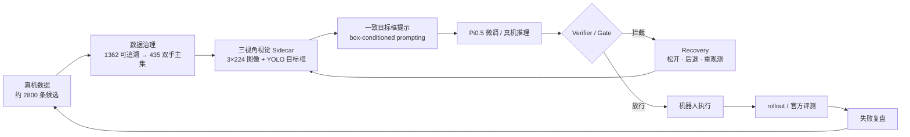

这是 RoboChallenge **G2 真机抓取**项目，围绕密集货架取物任务，用真实数据微调 Pi0.5，并结合三视角视觉 Sidecar、YOLO 目标框和安全 Gate，处理“目标看得见，但策略可能抓错实例或执行不安全”的问题。

项目覆盖**真机数据治理、Pi0.5 微调、三视角视觉增强、box-conditioned prompting、动作 Gate / Recovery 以及官方评测复盘**。Pi0.5、LeRobot、YOLO 为上游框架或模型，系统重点是把数据、视觉提示、策略推理、安全约束和真机评测接成一条能运行、能排错、能复盘的链路。

## 项目目标

真机失败表明“目标在画面里”不等于策略一定抓对那个实例。因此重点解决：

- 如何把原始采集数据清洗成能训练的高质量主集；
- 如何用三视角目标框在训练和推理阶段给 VLA 一致的视觉提示；
- 如何让模型动作在真正执行前经过安全 Gate；
- 如何根据官方 rollout、Trace 和视频复盘真实失败，而不是只展示成功片段。

## 主要工作

- 清洗 RoboChallenge 真机数据，处理 Prompt 与真实动作不一致、静止尾段、错误持物和多相机时间错位等问题；
- 将约 **2,800 条候选数据整理为 435 条高质量双手主集**，用于 Pi0.5 真机任务微调；
- 使用 PyTorch 三视角视觉 Sidecar 处理 **3×224 图像 + 26D 状态**，结合 YOLO 目标框突出目标实例；
- 在训练/推理图像上叠加一致目标框作为 **box-conditioned prompting**，让策略优先关注框内目标；
- 用 Verifier / Gate / Recovery 对在线执行增加安全约束；
- 根据官方 rollout、Trace 和视频复盘真实失败，区分检测、目标选择、动作生成与执行阶段问题。

## 系统怎么工作

**真机数据 → 数据治理 → 三视角 YOLO / 视觉提示 → Pi0.5 训练与推理 → Verifier / Gate → 机器人执行 → rollout / 官方评测 → 失败复盘 → 回到数据和训练**

## 关键工程工作

### 1. 真机数据先治理，再继续训练

RoboChallenge 真机数据从约 **2800 条候选 → 1362 条可追溯 RAW 数据 → 435 条高质量双手主集**。清洗重点包括 Prompt 与实际抓取目标不一致、抓取后错误状态、长时间静止尾段和多相机时间错位等问题。

行为克隆会认真学习监督数据中的错误，因此**数据治理本身是策略工程的一部分**。

### 2. 三视角视觉增强不是替代 VLA，而是给它更明确的目标

视觉 Sidecar 独立运行 YOLO / classifier，从三个相机视角找到目标实例，并把一致目标框叠加到送入策略的图像中。这样做的目的不是让 YOLO 直接控制机器人，而是让 VLA 在密集、相似商品环境里更容易把注意力放到正确目标上。

这种训练和推理阶段都保持一致的目标框提示，可以理解为 **box-conditioned prompting**：框是视觉条件，动作仍由 Pi0.5 产生。

### 3. 在线执行再加安全 Gate

视觉提示解决“看谁”的问题，但不能保证每个动作都安全。因此在线链路仍保留 Verifier、Gate 和 Recovery：条件不满足时不继续盲目执行，而是松开、后退或重新观测。

## 项目结果

- RoboChallenge 单目标官方评测：**79 分 / Success Rate 0.6 / 11 rollouts，总排名第六**；
- 训练配置：**8×H200、batch 192、5000 steps**；
- 双目标研究线：**35.5 分 / SR 0.1 / 13 rollouts / 1 次完整成功**，瓶颈在相似实例选择与双手状态管理，仍在持续迭代。

## 技术栈

**Pi0.5 · LeRobot · OpenPI · G2 · YOLO · 三视角 Vision Sidecar · Box-conditioned Prompting · Verifier / Gate / Recovery · JAX / PyTorch**

