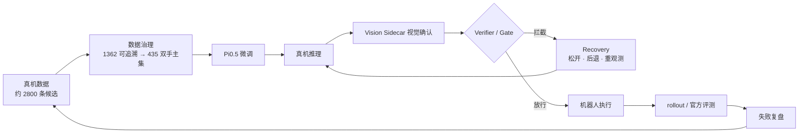

这是 RoboChallenge **G2 真机抓取**项目，围绕超市货架抓取任务，用真实数据微调 Pi0.5，并在主策略外增加视觉确认和安全门，处理"模型动作能出，但目标可能选错或执行不安全"的问题。

项目覆盖**真机数据治理、Pi0.5 微调、Vision Sidecar、动作 Gate / Recovery 以及官方评测复盘**。Pi0.5、LeRobot、YOLO 为上游框架或模型，系统重点是把它们接成一条能真机运行、能排错、能复盘的链路。

## 项目目标

真机失败表明"目标在画面里"不等于策略一定抓对那个实例。因此重点解决：

- 如何把原始采集数据清洗成能训练的高质量主集；
- 如何让模型动作在真正执行前经过独立视觉确认和安全 Gate；
- 如何根据官方 rollout、Trace 和视频复盘真实失败，而不是只展示成功片段。

## 主要工作

- 清洗 RoboChallenge 真机数据，处理 Prompt 与真实动作不一致、静止尾段、错误持物等问题；
- 使用 Pi0.5 进行真机任务微调；
- 将 YOLO detector / classifier 独立成 Vision Sidecar，并用 Gate / Recovery 与主策略组合；
- 根据官方 rollout、Trace 和视频复盘真实失败，而不是只展示成功片段。

## 系统怎么工作

**真机数据 → 数据检查与治理 → Pi0.5 微调 → 真机推理 → 视觉确认与安全 Gate → 机器人执行 → rollout / 官方评测 → 失败复盘 → 回到数据和训练**

## 关键工程工作

### 1. 真机数据先治理，再继续训练

RoboChallenge 真机数据从约 **2800 条候选 → 1362 条可追溯 RAW 数据 → 435 条高质量双手主集**。清洗重点包括 Prompt 与实际抓取目标不一致、抓取后错误状态、长时间静止尾段和多相机时间错位等问题。

行为克隆会认真学习监督数据中的错误，因此**数据治理本身是策略工程的一部分**。

### 2. VLA 外面再加一层独立视觉确认

主策略外增加独立 Vision Sidecar，让 detector / classifier 提供目标证据，再由 Verifier 和 Gate 决定当前动作是否允许继续；不满足条件时进入 Recovery，而不是让策略无条件执行到底。

## 项目结果

- RoboChallenge 单目标官方评测：**79 分 / Success Rate 0.6 / 11 rollouts**（无公开榜单截图，不报排名）；
- 双目标研究线：**35.5 分 / SR 0.1 / 13 rollouts / 1 次完整成功**，瓶颈在相似实例选择与双手状态管理，仍在持续迭代。

## 技术栈

**Pi0.5 · LeRobot · OpenPI · G2 · YOLO · Vision Sidecar · Verifier / Gate / Recovery · JAX / PyTorch**
