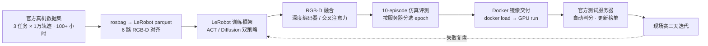

# REAL-I · ICRA 2026 人形机器人操作赛

> **一句话定位**：REAL-I 2026（ICRA 2026 官方旗舰赛）。在乐聚 Kuavo 4 Pro 全尺寸人形（41+ 自由度、7-DoF 双臂）上，把「官方数据集 → ACT/Diffusion 双策略训练 → RGB-D 深度融合 → Docker 交付 → 官方 10-episode 自动评测 → 现场迭代」接成一条可复现链路，队伍「断雁无凭」总榜第 2（23.1 分），仿真任务榜第 3（92.98 分）。

**硬指标**：三阶段（仿真 → 真机 → 现场）共 **81 次提交**，逐次分数与服务器评语全部可回查；官方测试服务器 10-episode 自动评测为唯一选模依据；现场当天 12 分钟完成「评测 → 选模 → 打包 → 提交」闭环。

## 架构 · 一张图看懂

**官方数据集 → rosbag 转 parquet → 双策略训练（ACT / Diffusion + RGB-D 融合）→ 10-episode 仿真评测选模型 → Docker 打包 → 测试服务器自动判分 → 现场赛迭代提交**

## 3 个关键技术决策

### 1) 一套训练、多任务复用 — 双策略并行

- **问题**：三个现场任务时序长短差异大，单一策略无法同时覆盖。
- **选择**：基于 LeRobot 0.4.2 二次开发，一次训练 run（2026-04-24）同时产出 ACT 与 Diffusion 两族 checkpoint（epoch30~200），按任务特性选择：短链路时序任务（金属件翻面）用 ACT（chunk 30）；长链路五段任务（快递扫描）用 Diffusion（horizon 16 / step 8）+ 深度融合 + 双帧观测。
- **证据**：三阶段提交记录中每个任务的策略与 epoch 可回查。

### 2) RGB-D 深度融合 — 语义与几何互补

- **问题**：现场光照/背景变化下，RGB 与深度单模态互相都不能兜底。
- **选择**：核心算法改动为 RGB-D 深度融合——Diffusion 侧共享 ResNet18 深度编码器；ACT 侧 RGB↔Depth 双向交叉注意力。RGB 定语义（标签朝向、物体类别），深度定几何（抓取位姿、翻面余量）。
- **定位**：融合方式随策略结构定制，而非简单拼接模态。

### 3) 以官方评测为唯一选模依据 — 现场 12 分钟闭环

- **问题**：离线指标与服务器判分不一致时，训练集上的好坏不可信。
- **选择**：以官方 10-episode 自动评测分数为唯一依据；现场当天 Day1 金属件：16:32 评测 epoch100 → 18:16 评测 epoch200 → 18:28 打包提交 → 20:29 服务器判分，评测、选模、打包、提交全在服务器上闭环完成。交付链：`KuavoBaseRosEnv`（10Hz 关节+夹爪下发）+ 多模态帧对齐 + Docker 镜像（基座 `final:v3.2`，`docker load → run --gpus all`）。
- **证据**：81 次提交里包含真实失败样本（`.zip` 打包回归、镜像内模型路径缺失、ROS 话题配置不一致），每次定位修复后重交——失败也是证据。

## 量化结果

| 阶段 | 任务 | 提交次数 | 最高分 |
|---|---|---|---|
| 仿真 | 玩具分拣 | 4 | **92.98**（任务榜第 3） |
| 仿真 | 传送带分拣 | 14 | 86.6 |
| 仿真 | 快递称重 | **37** | 74.64 |
| 真机 | 日化瓶交接 | 3 | 68 |
| 真机 | 包裹扫描 | 5 | 54 |
| 真机 | 金属件翻面 | 6 | 28 |
| 现场 | 快递扫描 | 3 | 18.3 |
| 现场 | 日化瓶 | 5 | 4 |
| 现场 | 金属件 | 4 | 0.8 |

- **总榜第 2 名 / 23.1 分**（第 1 名 NUS-CLEAR 34.3 分，共 10 队上榜）。
- 仿真 → 真机 → 现场的分数衰减（92.98 → 28 → 0.8）直接定义了后续技术方向：域随机化、显式朝向分类器门控、eef delta 控制。

## 边界与可迁移

- LeRobot 为上游框架，本项目重点在数据转换、训练链路、部署与评测迭代的系统闭环，而非框架本身。
- 现场分数远低于仿真，域随机化与门控仍未落地；现场提交含失败样本，如实呈现。
- 可迁移：官方数据 → 训练框架的对齐范式、按任务选策略的双线管理、Docker GPU 镜像交付、以服务器判分为唯一依据的选模纪律、逐次提交的得分证据链。

> 深度文档：`content_out/P06-REAL-I/`（含 81 次提交全记录、RGB-D 融合实现细节与 Docker 交付说明）
