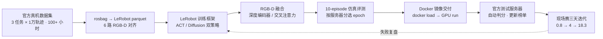

这是 **REAL-I 2026（ICRA 2026 官方旗舰赛）** 项目：在乐聚 **Kuavo 4 Pro** 全尺寸人形机器人（41+ 自由度、7-DoF 双臂）上，用 LeRobot 模仿学习完成从官方数据集到 ICRA 现场赛的完整闭环。队伍「断雁无凭」最终 **总榜第 2（23.1 分）**，仿真任务榜第 3（92.98 分）。

项目覆盖**数据转换、ACT / Diffusion Policy 双策略训练、RGB-D 深度融合、Docker GPU 部署、官方测试服务器 10-episode 自动评测与现场赛提交迭代**。LeRobot 为上游框架，系统重点是把「数据 → 训练 → 评测 → 交付 → 现场」接成一条可复现、可迭代的链路，并完整保留 81 次提交的得分证据链。

## 项目目标

- 如何在 100+ 小时、6 路 RGB-D 真机示教数据上训练稳定的人形双臂操作策略；
- 如何同时维护 ACT 与 Diffusion Policy 两条策略线，并按任务选择；
- 如何让 RGB 与深度两种模态在策略里真正互补，而不是简单拼接；
- 如何用 Docker 镜像把模型+推理代码一键交付到官方测试服务器自动评测。

## 主要工作

- 官方数据集 rosbag → LeRobot parquet 转换，6 路相机 RGB-D 与关节/控制信号时间对齐；
- 基于 LeRobot 0.4.2 二次开发训练框架：**ACT**（chunk 30）与 **Diffusion Policy**（horizon 16 / step 8）双策略并行；
- 训练加速：**Accelerate DDP + AMP** 多卡训练；
- 部署链含 **WBC 策略部署**，把训练策略接到真机全身控制执行链；
- 核心算法改动 **RGB-D 深度融合**：Diffusion 侧共享 ResNet18 深度编码器；ACT 侧 RGB↔Depth 双向交叉注意力；
- 部署链：`KuavoBaseRosEnv`（10Hz 关节+夹爪下发）+ 多模态帧对齐 + Docker 镜像交付（基座 `final:v3.2`，`docker load → run --gpus all`）；
- 以官方 10-episode 自动评测为唯一选模型依据：现场当天 epoch100/200、epoch50/100 多轮评测后择优选交；
- 三阶段（仿真 → 真机 → 现场）共 **81 次提交**，逐次分数与服务器评语全部可回查。

## 系统怎么工作

**官方数据集 → rosbag 转 parquet → 双策略训练（ACT / Diffusion + RGB-D 融合）→ 10-episode 仿真评测选模型 → Docker 打包 → 测试服务器自动判分 → 现场赛迭代提交**

## 关键工程工作

### 1. 一套训练、多任务复用
一次训练 run（2026-04-24）同时产出 ACT 与 Diffusion 两族 checkpoint（epoch30~200），现场三个场景按任务特性选择：短链路时序任务（金属件翻面）用 ACT chunk 30；长链路五段任务（快递扫描）用 Diffusion + 深度融合 + 双帧观测。

### 2. RGB-D 融合是核心算法改动
RGB 定语义（标签朝向、物体类别），深度定几何（抓取位姿、翻面余量）。两条策略各用一种融合方式，解决单模态在现场光照/背景变化下互相都不能兜底的问题。

### 3. 现场 12 分钟换模型提交
Day1 金属件：16:32 评测 epoch100 → 18:16 评测 epoch200 → 18:28 打包提交 → 20:29 服务器判分。评测、选模、打包、提交全在服务器上闭环完成。

### 4. 失败也是证据
81 次提交里包含真实的失败样本：`The submitted file is not in .zip format`（打包回归）、`no model`（镜像内模型路径缺失）、`fix env`（ROS 话题配置不一致），每次都定位修复后重交。

## 项目结果

| 阶段 | 任务 | 提交次数 | 最高分 |
|---|---|---|---|
| 仿真 | 玩具分拣 | 4 | **92.98**（任务榜第 3） |
| 仿真 | 传送带分拣 | 14 | 86.6 |
| 仿真 | 快递称重 | **37** | 74.64 |
| 真机 | 日化瓶交接 | 3 | 68 |
| 真机 | 包裹扫描 | 5 | 54 |
| 真机 | 金属件翻面 | 6 | 28 |
| 现场 | 快递扫描 | 3 | 18.3 |
| 现场 | 日化瓶 | 5 | 4 |
| 现场 | 金属件 | 4 | 0.8 |

- **总榜第 2 名 / 23.1 分**（第 1 名 NUS-CLEAR 34.3 分，共 10 队上榜）
- 仿真 → 真机 → 现场的分数衰减（92.98 → 28 → 0.8）直接定义了后续技术方向：域随机化、显式朝向分类器门控、eef delta 控制。
