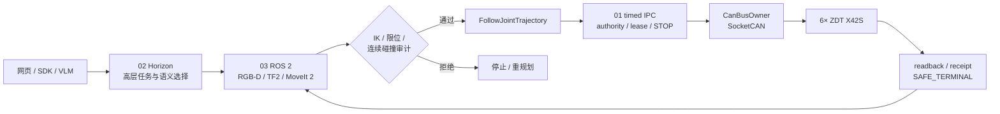
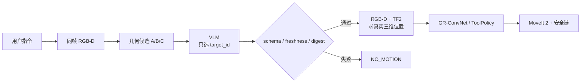

PAROL6 是我围绕一台六轴机械臂搭建的完整机器人系统：从 ZDT X42S / SocketCAN 底层执行、关节坐标与多圈恢复，到 ROS 2 / MoveIt 2 规划、D405 RGB-D、GR-ConvNet 近场抓取、VLM 语义选目标，再到 STOP、authority、碰撞审计和 receipt 证据链。机械本体、ROS 2 / MoveIt 2、GR-ConvNet 和 VLM 都是上游结构、框架或模型；我主要完成硬件选型与集成、接口适配、CAN 执行链、标定、规划执行、视觉抓取、安全门、真机调试和验证。

<figure>

<figcaption>PAROL6 真机：六轴本体、eye-in-hand D405、STS3215 夹爪与桌面作业区。</figcaption>
</figure>

## 一条完整链路

系统不是让 VLM 或规划器直接控制电机，而是把高层智能限制在候选和任务层，最终所有真机运动都收敛到唯一执行核心。



<figure>

<figcaption>三层软件职责：02 负责高层 AI / UI，03 负责 ROS 2、感知与规划，01 负责唯一硬件执行权和安全终态。</figcaption>
</figure>

## 1. 底层执行：先把六轴坐标做对

六个 ZDT X42S 闭环步进驱动器通过 CANable2 接入 SocketCAN，CAN 为 500 kbit/s 扩展帧，地址 1–6。底层统一使用机器人关节坐标：

```text
q_i = s_i (θ_motor - θ_0) / r_i
```

其中方向、零位、减速比和逻辑 offset 都在同一个 canonical 坐标源处理。当前减速比为 J1 6.4、J2 28.5、J3 24.0、J4/J5 4.0、J6 14.0。这样 RViz、MoveIt、网页和抓取脚本不会各自再补一套偏置。

状态读回由 `0x31` 圈内角和 `0x36` 多圈位置共同约束。断电后如果机械臂已经被人工放回 canonical Home 附近，可以只利用当前 `0x31` 精确读数选择正确电机圈数并恢复坐标，整个恢复过程保持 `NO_MOTION`；解不唯一时不猜，也不会为了“找坐标”先盲动机械臂。

CAN 只允许一个 `CanBusOwner` 真正访问总线。每个控制 tick 先逐轴缓存 `0xF6` 速度帧，本拍停止轴写 `0xFE`，六轴准备完成后由地址 0 发送 `FF 66 6B` 统一触发。这个设计修掉过“同一拍先停后触发导致六轴速度向量不同步”的问题。

## 2. 标定：不是只求一个手眼矩阵

我把整机标定拆成一条可以逐层验证的链：

```text
关节方向 / 减速比 / 零位 / 多圈
        ↓
TCP Pivot
        ↓
D405 内参与 eye-in-hand
        ↓
AX = XB 手眼求解
        ↓
独立留出 + 跨姿态物理验证
        ↓
外部 C930c + 50 mm 立方体诊断
        ↓
必要时进入局部视觉闭环
```

### TCP Pivot

工具尖端固定在同一个物理点，机械臂改变多个姿态，通过

```text
R_i t + p_i = c
```

联合求 `tool0 → TCP`。当前正式结果使用 23 帧，TCP 偏移约为 `[0.007668, -0.059899, 192.680078] mm`，独立留出约 `0.031654 mm`。这个数字表示 TCP 几何拟合一致性，不等同于整机绝对定位精度。

### Eye-in-hand 手眼标定

D405 固定在末端，使用机器人 `base → tool0` 与棋盘 PnP 构造相对运动并求 `AX = XB`。一次正式路径复现中，train / LOO / independent 分别约为 `0.865 / 1.190 / 1.359 mm`；但回到基线姿态后仍观察到 camera `3.048 mm / 0.415°`、tool0 `1.377 mm / 0.410°` 的变化，因此最终没有把这组外参签发给机器人运动，保持 `usable_for_robot_motion=false`。

这个结果改变了后续方法：优化残差好看不代表物理链成立。项目又加入固定 C930c 外部相机和 `50×50×50 mm` 三面刚性标定块，用来区分手眼外参与方向相关回差、安装刚性和结构误差；全局几何链不过门时，近场任务改用局部反馈闭环。

## 3. ROS 2 / MoveIt 2：规划结果还不能直接执行

ROS 2 主线包含 TF2、URDF/SRDF、PlanningScene、MoveIt 2、FollowJointTrajectory、diagnostics 和证据记录。规划主要使用 OMPL RRTConnect 与 Pilz PTP/LIN，随后做时间参数化，再对整条轨迹进行连续碰撞审计。

```text
fresh robot state + RGB-D / scene
        ↓
TF2 / PlanningScene
        ↓
MoveIt 2: OMPL / Pilz
        ↓
时间参数化
        ↓
全轨迹连续碰撞审计
        ↓
bit-exact trajectory digest
        ↓
FollowJointTrajectory
        ↓
01 timed IPC
        ↓
CAN 真机
```

轨迹和 scene / tool 版本绑定，审计以后不能悄悄换一条新轨迹。一次障碍任务在旧轨迹约 8.69 s 出现 J4 stall 后，系统安全停止，没有重放旧轨迹，而是从 fresh 中途姿态重建场景并重新规划；新轨迹 102 点、4.990011 s，FJT `status=4`，终点最大误差约 `0.105086°`。

另一个实际问题来自跨层重复时间缩放：03 已经把约 13 个 MoveIt 路点加密成约 300 个 10 ms 点，01 又把离散位置二次求导后再次按加速度缩放，导致合法轨迹被自动放慢 `2.65–3.36×`。修复后，已验证 schedule 不再重复缩放，但底层物理速度、加速度和 STOP 约束仍保留；新真机 receipt 恢复到 `time_scale=1.0`。

## 4. RGB-D 与 GR-ConvNet：从“看见”到真正抓住

D405 以 eye-in-hand 方式提供 RGB-D。高位阶段先用同帧深度、桌面和几何关系锁定目标，近场再切到 GR-ConvNet 生成抓取中心、yaw、开口和质量候选。我在模型之外加入了夹爪 self-mask、桌面平面过滤、候选可达性、真实夹爪几何和闭爪前安全门。

<figure>

<figcaption>D405 深度观测用于桌面、目标几何和近场抓取判断。</figcaption>
</figure>

2026-08-08 的 20 mm 白色方块回合完成了 GR-ConvNet 真机完整抓放：抓取轴约 `0.14°`，指尖相对实测桌面保留约 `2.74 mm` 净空；闭爪后 `load=312 / object_detected=true`，Z+50 mm 抬升后仍为 `304 / true`，到固定释放位仍保持持物，开爪后变为 false，最终 FJT `status=4 / error_code=0 / SAFE_TERMINAL_CONFIRMED`。

<figure>

<figcaption>真机抓取成功证据帧之一；项目保留成功回合和失败回合，而不是只展示最好的结果。</figcaption>
</figure>

<figure>

<figcaption>闭爪确认后才允许进入抬升阶段。</figcaption>
</figure>

项目也保留过一个相反案例：视觉候选和局部纠偏看起来都不错，但闭爪前 FK 计算的指间覆盖只有 `17.70 mm`，动态要求为 `17.89 mm`，差 `0.19 mm`。系统选择拒绝闭爪并上退，而不是为了完成 Demo 放宽门限。成功案例证明链路能工作，拒绝案例证明安全门真的会工作。

## 5. VLM：只决定“哪个目标”，不决定“机器人往哪走”

VLM 被限制在语义选择层。D405 同一帧先生成经过几何过滤的 A / B / C 候选，VLM 通过 strict JSON 只允许返回 `target_id` 和 `confidence`；真正三维坐标仍由 RGB-D 反投影与 TF2 计算，动作由既有 ToolPolicy、GR 和 MoveIt 链决定。额外坐标字段、非法 ID、低置信度或 frame / request 摘要变化都会在运动之前被拒绝。



真机多物体回合中已经出现三类可区分结果：候选 A 完成真实抓取、抬升、固定释放和开爪；候选 B 闭爪为空后被检测出来，系统禁止空夹继续抬升并恢复；候选 C 在粗接近阶段因为 L3/L5 自碰撞，在运动前直接拒绝。

这条 VLM 链已经真机运行，但多物体鲁棒性还没有收口。截至当前归档，历史页统计为 `2/15 = 13.3%`；主要剩余问题是近场遮挡后目标重新出现时，fresh 像素锚与错误 FK continuation 之间的目标身份保持。因此我把它标记为“链路已打通、鲁棒性仍在改进”，而不是成熟产品级成功率。

## 6. 局部视觉闭环：用反馈吸收全局几何链的剩余误差

当全局 hand-eye 无法稳定通过物理验证时，项目没有用一个固定 XYZ 偏置去“硬修”。近场阶段会用 2–3 mm 的小幅 Cartesian 扰动观察图像特征变化，估计局部像素 Jacobian，再用阻尼最小二乘计算下一步修正。

```text
图像误差 e
   ↓
局部 Jacobian J_img
   ↓
Δx = J_img^+ e
   ↓
小步运动
   ↓
重新观察并更新
```

一组真实扰动实验中，初始约 `10.463 mm` 的偏差经过六步局部闭环收到约 `1.658 mm`。它不是全局标定的替代品，而是在任务局部范围内利用反馈抵消外参、回差和安装/结构误差的工程降级方案。

## 7. 安全与证据：成功不是 UI 上显示“完成”

这个项目里，安全不是单独一个急停按钮，而是贯穿整条链：

- canonical 软限位直接进入 IK 和执行约束；
- stale robot state / stale scene 不允许继续规划或执行；
- 整条轨迹经过连续碰撞审计；
- scene / tool / trajectory 使用版本化 digest 绑定；
- 高层 VLM / 学习策略不能持有 CAN owner；
- authority / lease 控制谁有运动权；
- timeout 不猜成功，而是进入 `RESULT_UNKNOWN` 或停止收口；
- 只有底层状态确认 STOP、六轴零速、无 fault、权限清空后，才生成安全终态 receipt。

<figure>

<figcaption>固定放置位置释放。</figcaption>
</figure>

<figure>

<figcaption>任务完成或异常恢复后回到可审查的安全终态。</figcaption>
</figure>

## 8. 控制实验与学习策略

在真机确定性链之外，我做了模型控制对照，目的是理解未来学习策略应该和什么基线比较，以及失效时如何降级。

二连杆仿真中手写 LQR，相比纯 PID 的末端误差改善约 `95.29%`；有限时域 MPC 使用 18 步预测窗口并显式处理控制约束。MuJoCo 六轴模型中，对同一 URDF 做纯 PID、PID + 重力补偿和计算力矩对照：纯 PID 六轴 RMSE 约 `8.8847°`，加重力补偿后约 `0.5349°`，计算力矩的 TCP RMSE 约 `0.1911 mm`。这些结果全部属于 simulation-only，不作为真机精度。

ACT、Diffusion Policy、FlowPolicy、SmolVLA 以及 PPO / DPPO 等学习策略目前属于扩展方向，没有进入 PAROL6 真机主执行链。未来无论接哪一种策略，输出也只允许是目标候选、Cartesian 小步或短 trajectory chunk，仍必须经过 freshness、IK、限位、碰撞、authority、STOP 和 receipt。

<video controls playsinline preload="metadata" poster="/portfolio/parol6/isaac-overview.png" src="/portfolio/parol6/isaac-orbit.mp4"></video>
<figcaption>Isaac 中的整机模型。仿真用于模型、规划和碰撞对照，不替代真机抓放证据。</figcaption>

## 9. 几个真正改变系统设计的问题

### 坐标偏置不能散落在各层

早期现场补偿容易分别出现在网页、模型或脚本里。最终把 J2/J3/J5 等逻辑偏移迁到 01 的 canonical joint source，命令投影和 readback 使用同一组正逆变换，软限位同步迁移。这样上层只消费一个机器人坐标真值。

### 轨迹已经时间参数化，就不能在下一层再次“凭感觉”减速

FJT 的 `2.65–3.36×` 重复减速问题最终被定位为跨层职责重复。修复不是删除底层安全检查，而是给 schedule 标记 provenance：未经验证的外部轨迹继续完整动态检查，已验证轨迹不重复时间缩放，物理上限仍由底层兜底。

### 标定指标漂亮，也可能不能用于运动

手眼的 train / LOO / independent 均达到毫米级，但跨姿态和回基线物理稳定性不过门，所以没有签发。这也促成了外部 C930c、刚性立方体诊断和局部视觉闭环的加入。

### 抓取规则应该相对物理基准，而不是绑定某次绝对坐标

后续抓取把很多绝对 base Z 门限改成“相对于当前实测桌面”的高度，并把横向目标从某一侧夹爪边缘改为两指实际开口中线。重新标定桌面或夹爪后，规则不需要依赖旧绝对常数继续工作。

## 10. 当前完成度与边界

目前可以明确确认的是：六轴 CAN 执行、NO_MOTION 多圈恢复、ROS 2 / MoveIt 2 → FJT → timed IPC 真机链、经典 RGB-D 抓放、GR-ConvNet 白块完整抓放、VLM 语义选择真机链、TCP Pivot 和局部视觉闭环都已经有真实运行或签收证据。

仍然保留的边界也很明确：全局 eye-in-hand 外参没有签发为运动真值；VLM 多物体链的历史成功统计仍低，目标身份保持需要继续修；当前没有一个可以外推到“任意物体 / 任意位置”的总体抓取成功率；LQR / MPC / 计算力矩和学习策略部分不能当成 PAROL6 真机控制精度或 RL 真机成果。

## 代码与工程仓库

- [01-Parol6：CAN、坐标、STOP、authority 与最终 receipt](https://github.com/l2ktech/01-Parol6)
- [03-Parol6-Ros2：ROS 2、MoveIt 2、RGB-D、GR-ConvNet 与 M3 抓取主线](https://github.com/l2ktech/03-Parol6-Ros2)
- [02-Parol6-Horizon：VLM、Web UI、SDK 与高层任务接口](https://github.com/l2ktech/02-Parol6-Horizon)

这三个仓库共同组成同一套系统：01 保存硬件和执行真值，03 保存机器人软件与抓取主线，02 保存高层智能与交互层。