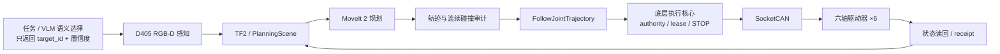

这是一个围绕 **PAROL6 六轴机械臂**搭建的 ROS2 真机整机系统。项目从底层电机与 SocketCAN 开始，向上接入 ROS 2 / MoveIt 2、RealSense D405、RGB-D 抓取和 VLM 语义选目标，最后把所有动作统一收敛到带安全检查的真机执行链。

项目覆盖**硬件与接口集成、CAN 执行链、ROS 2 / MoveIt 2 规划执行、标定、RGB-D 抓取、MuJoCo 动力学仿真、安全门和真机调试验证**。机械臂本体、MoveIt 2、GR-ConvNet 和 VLM 为上游组件，系统重点是把它们集成为一套可运行、可排错、可验证的完整链路。

## 项目目标

项目目标不是让机械臂"动起来"，而是完成一条完整、可控的任务链：

- 稳定读取并执行六轴关节状态；
- ROS 2 / MoveIt 2 基于真实状态规划并执行轨迹；
- D405 提供目标 RGB-D 信息；
- 抓取模块生成候选，并在真机上安全完成接近、闭爪、抬升和释放；
- VLM 理解"抓哪个目标"，但不能绕过几何和安全层直接控制机器人；
- MuJoCo 用于同一机器人模型的动力学仿真、关节状态观察和控制响应验证；
- 任何异常都应停止、拒绝或重新规划，而不是继续盲目执行。

## 主要工作

- 集成六轴驱动器、CANable2 与 **SocketCAN**，建立唯一底层执行入口；
- 统一关节方向、零位、减速比和多圈位置，保证底层与 ROS 坐标一致；
- 搭建 **ROS 2 / TF2 / MoveIt 2 / FollowJointTrajectory** 执行链（六轴数值 IK 用 KDL `ChainIkSolverPos_LMA`，多解选最接近当前姿态且不超限不撞的解）；
- 使用 D405 完成 RGB-D 感知、目标三维位置计算与 eye-in-hand 调试；
- 接入 GR-ConvNet 抓取候选，并增加桌面、夹爪几何和可达性过滤；
- 把 VLM 限制在语义目标选择层，真正运动仍由 RGB-D、TF2、规划器和安全逻辑决定；
- 在 MuJoCo 中配置质量、惯量、重力、关节阻尼与 actuator，观察关节位置、速度和控制响应；
- 处理 TCP、手眼标定、碰撞、轨迹时间参数化和真机异常；
- 建立 STOP、状态新鲜度、轨迹审计、持物确认等执行安全规则。

## 系统怎么工作

**任务 / VLM → RGB-D 感知与目标选择 → TF2 / PlanningScene → MoveIt 2 规划 → 轨迹与碰撞检查 → FollowJointTrajectory → 底层执行核心 → SocketCAN → 六轴驱动器 → 状态读回**

这套系统的关键设计是：**高层模块可以提"做什么"，但不能直接决定电机"怎么动"。** 所有真机动作都必须经过同一套坐标、规划、碰撞和安全检查。

## 关键工程工作

### 1. 把底层坐标统一起来

机器人系统很容易出现"RViz 看起来对、真机却偏"的问题。项目把关节方向、零位、减速比和多圈恢复放在统一坐标源中处理，避免网页、ROS、抓取脚本和底层驱动各自补一套 offset。

### 2. 规划结果还要经过真机安全链

MoveIt 2 规划成功不等于可以直接执行。系统继续检查 robot state、PlanningScene、关节限位、整条轨迹碰撞以及执行终态；出现 stall 或环境变化时，从 fresh 状态重新规划，而不是重复播放旧轨迹。

### 3. 从 RGB-D 候选到真正抓取

D405 提供同帧 RGB-D，近场抓取使用 GR-ConvNet 生成抓取候选，再结合桌面、夹爪 self-mask、可达性和真实夹爪尺寸过滤。闭爪之后还要检查是否真的持物，只有确认后才允许抬升。

### 4. VLM 只做语义选择

VLM 只返回候选目标 ID 和置信度。目标的三维坐标仍由 RGB-D 与 TF2 计算，机器人运动仍走既有规划和安全链。这样既能利用大模型理解指令，又不会让不可控输出直接进入电机层。

### 5. MuJoCo 动力学仿真

同一 PAROL6 模型接入 MuJoCo，配置 link 的质量与惯量、重力、关节阻尼、限位和 actuator。仿真中重点观察 `qpos / qvel` 等关节状态和控制输入后的动态响应，用于理解和验证“模型参数 + 当前状态 + 控制输入 → 下一时刻运动状态”这条动力学链。

这里把 MuJoCo 作为**动力学仿真和控制链验证工具**，不把重力补偿或计算力矩控制写成已经完成的真机控制能力。

## 项目结果

项目已完成 **20 mm 白色方块的真机完整抓放闭环**：视觉选取、接近、闭爪确认、抬升、移动到释放位、开爪以及安全终态都走同一条执行链。

数字孪生可视化与测试在 Isaac Sim 中完成；同一 PAROL6 模型在 MuJoCo 中进行动力学仿真，用于观察关节状态、控制响应和模型参数对运动结果的影响。

手眼外参在跨姿态物理验证不足时不签发给运动链；多物体 VLM 抓取链已真机运行，鲁棒性仍在持续迭代。

项目把**底层执行、ROS 2 规划、视觉感知、语义模型、动力学仿真和真机安全**连成一个系统，并支持沿执行链定位问题。

## 技术栈

**ROS 2 · MoveIt 2 · TF2 · FollowJointTrajectory · SocketCAN · ZDT X42S · RealSense D405 · RGB-D · GR-ConvNet · VLM · MuJoCo · Python / C++**
