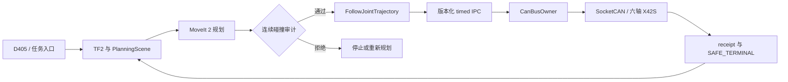

PAROL6 不是“机械臂能动”就结束。网页、SDK、ROS 2 和视觉都可以发任务，但只有一个进程能持有 SocketCAN。规划结果要先过 fresh scene 和连续碰撞审计，再经版本化 IPC 下到执行核心；成功或失败都回到六轴零速、权限清空的安全终态。
<figure>

<figcaption>六轴本体、夹爪和桌面作业区。</figcaption>
</figure>
<video controls playsinline preload="metadata" poster="/portfolio/parol6/grasp-lift.png" src="/portfolio/parol6/isaac-orbit.mp4"></video>
<figcaption>Isaac 里的整机模型。仿真用来对照规划和碰撞，不替代真机抓放证据。</figcaption>
## 系统结构

<figure>

<figcaption>系统总架构：硬件、感知、规划、执行核心和安全边界。</figcaption>
</figure>
## 感知和抓取
D405 提供 RGB-D，桌面目标先进入场景，再决定抓取点。真机上已经做过受监督的黑块抓取、约 40 mm 抬升、原位放置和标准停车。近场视觉如果发现指间覆盖不够，系统会禁止闭爪并上退，而不是“只差一点就放行”。
<figure>

<figcaption>腕部 / 场景相机的深度观测。</figcaption>
</figure>
<figure>

<figcaption>闭爪后抬离桌面。</figcaption>
</figure>
<figure>

<figcaption>放置后开爪。</figcaption>
</figure>
<figure>

<figcaption>动作结束后的停车姿态。</figcaption>
</figure>
## 规划和安全
规划成功只说明找到了一条轨迹，不说明可以执行旧文件。审计要绑当前 scene；中途姿态变了就重新规划。J4 堵转这类失败会停在可回放的 receipt 上，下一次从 fresh 状态继续，而不是重放已经过期的轨迹。
<figure>

<figcaption>Isaac 中的整机和场景对照。</figcaption>
</figure>
## 现在能看到的结果
受监督抓放和 fresh 障碍轨迹可以回到 `COMPLETED / SAFE_TERMINAL`。MuJoCo / Isaac 用来对照控制和碰撞，不把仿真误差写成真机精度。当前没有可泛化的总体抓取成功率，也不把单段成功说成任意位置开环抓取。
