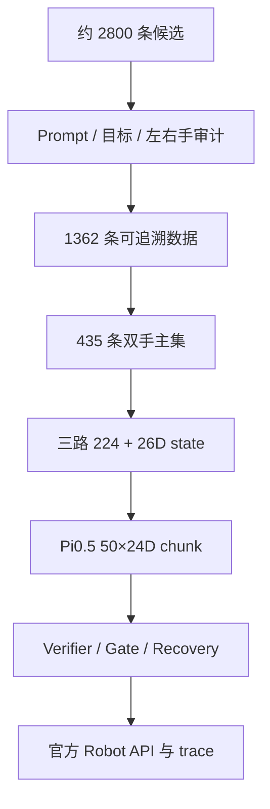

官方超市场景里，机器人按语言指定的饮料名称走到货架，在相似包装和遮挡下抓住目标，再送到推车投放。系统被拆成五层同时做对：数据语义、训练/在线输入一致、三路视觉、动作安全和官方 trace。

<video controls playsinline preload="metadata" poster="/portfolio/robochallenge-g2/grasp-success.png" src="/portfolio/robochallenge-g2/grasp-success.mp4"></video>

<figcaption>官方任务环境中的一次成功抓取。它证明这段闭环发生过，不代表双目标或全部 rollout。</figcaption>

## 数据怎样收到能训的程度

候选大约 2800 条，先按 prompt、目标、左右手、闭合帧和视频质量审计，留下 1362 条可追溯数据，再收到 435 条高质量双手主集。过滤是为了去掉冲突监督，不是为了把画面修得更好看。

<figure>

<figcaption>系统总览：数据治理、三路视觉、Pi0.5 和评测安全。</figcaption>
</figure>

## 视觉和在线控制

head、左腕、右腕三路图像进入 sidecar，detector / classifier 给出 2D 框和类别。框只增强观测，不是 6D 位姿。Pi0.5 一次输出 50 帧 24 维绝对动作，再过 verifier、空抓、高度和闭爪预算；过不去就开门爪、后退、扫描，重新看。

双目标还要记住哪只手已经抓住什么，Prompt 里写两个物体远远不够。很多失败发生在框已经出现之后，说明瓶颈不只在检测器。

<figure>

<figcaption>训练输入的相机视角：head / 左腕 / 右腕三路图像进入 sidecar 与策略。</figcaption>
</figure>

## 官方评测结果

单目标官方评测是 79 分，Success Rate 0.6，11 个 rollout。双目标后续实验最高 35.5 分，SR 0.1，13 个 rollout。这两条任务线不能混报，更不能说“加框以后从 79 变成了 35.5”。
