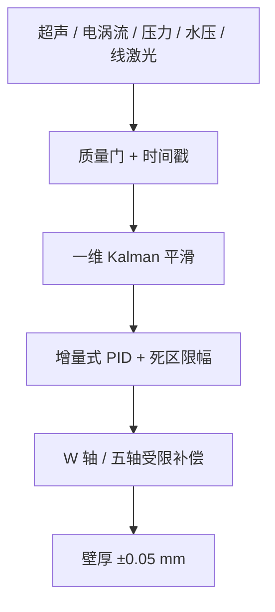

双五轴镜像铣里，刀具侧和支撑侧隔着薄壁工件相向运动。系统把五种信号——超声回波、四路电涡流、轴向压力、水压、线激光——组织成一条闭环：超声算厚度，电涡流定法向，压力管安全，水压管耦合质量，线激光给轮廓点云。厚度先过波形滤波和质量门，再走一维 Kalman 平滑和异常门，最后把补偿量喂到增量式 PID 做受限补偿。

## 五路传感器怎么分工
- 超声：主厚度，从回波飞行时间和声速算壁厚。
- 电涡流：四路测距，算探头法向，回答"探头该朝哪个方向"。
- 轴向压力：支撑头接触力，太小振动、太大压伤薄壁，用独立 W 轴快速修正。
- 水压：耦合状态，异常就降低厚度可信度。
- 线激光：像素反投影成点云，给扫描测量和碰撞边界。

## 估计与补偿
`KalmanFilter.cpp` 做一维状态估计，按 Q/R 加权融合、创新残差门限拒绝异常。`WCSUB.SPF` 里是死区、参数渐入、变速积分、增量式 PID、单步和总量限幅，异常时保持、降速或抬刀。

## 能确认的结果
壁厚补偿精度 ±0.05 mm，测厚精度 ±0.01 mm，采样 200 Hz。这是团队口径：我负责跨模块联调和软件分析，D-S 融合和 MPC 是我和同事一起实现的。
